# Getting Started 2 {.unnumbered}

*You can never look at the data too much.* -- Mark Engerman

The world confronts us. Make decisions we must.

We do all of our data science in the cloud, using GitHub Codespaces with Visual Studio Code (VS Code).

This chapter is a self-contained version of [Getting Started](getting-started.qmd). Instead of sending you off to run a separate tutorial from the **[tutorial.helpers](https://ppbds.github.io/tutorial.helpers/)** package, the "Getting Started" tutorial itself runs right here on this page, powered by **[learnr2](https://ppbds.github.io/learnr2/)** -- no Shiny app, no separate browser tab, nothing to install beyond the Codespace you are about to create.


## GitHub {.unnumbered}

Sign up for a GitHub account by following the instructions on the [GitHub homepage](https://github.com/). **Follow [this advice](https://happygitwithr.com/github-acct.html#username-advice) when choosing your username.**

Use your school email address for this account, if you are a student. The [GitHub Student Developer Pack](https://education.github.com/pack) provides all sorts of perks, but you must visit that page to turn on the benefits. It confirms your student status on the basis of you having an email account at your school. Next, [add a second email address](https://github.com/settings/emails) for this account, a permanent one that is not tied to your current school or job. After all, your school email address will disappear someday but your GitHub account is for life.

On GitHub, your projects are organized into "repositories," usually called "repos."

GitHub gives every account 60 free Codespaces hours per month. Free hours are not infinite, however, so it is your responsibility to stop (and delete) Codespaces you are no longer using.

## Use either Chrome or Edge {.unnumbered}

In theory, the below instructions work in any browser. In practice, we have found that the best experience is with either Chrome or Edge. If you are using a different browser, you may find that some of the instructions do not work as expected.

## A throwaway Codespace {.unnumbered}

You will work inside a `codespace-starter` Codespace. We use it here to learn the platform and run the "Getting Started" tutorial.

Go to [`https://github.com/PPBDS/codespace-starter`](https://github.com/PPBDS/codespace-starter).

```{r}
#| echo: false
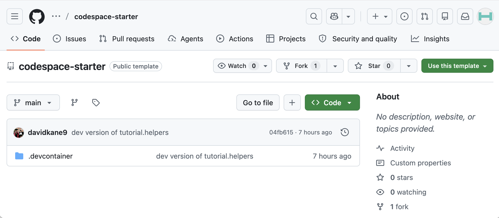
```

This Codespace is for learning the platform, not for your permanent work.

### Launching the Codespace {.unnumbered}

Click the green **Code** button at the top right of the repository page, switch to the **Codespaces** tab, and click **"Create codespace on main."**

```{r}
#| echo: false
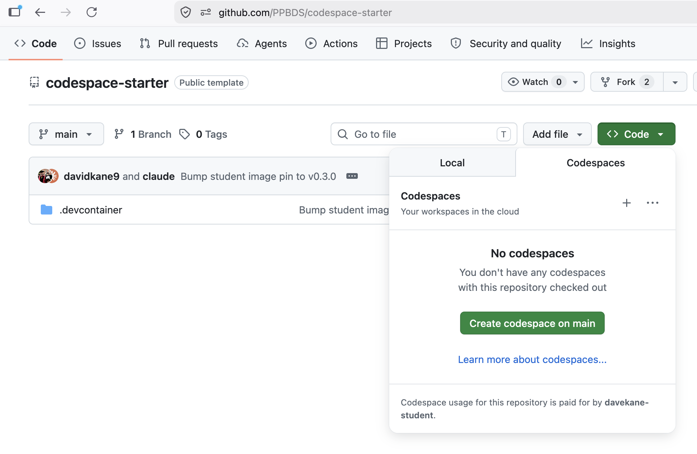
```

This will take a minute or so. Behind the scenes, GitHub is creating a virtual machine in the cloud with all the necessary tools for doing data science. That machine is called a "Codespace."

You may be asked: "Do you trust the authors of the files in this folder?"

```{r}
#| echo: false
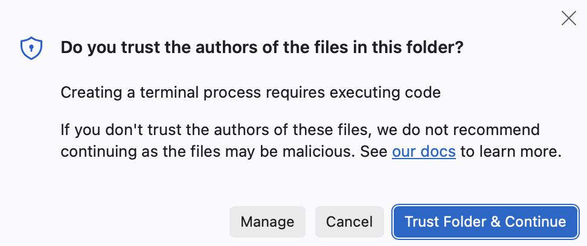
```

Click to agree.

Once the process is done, a banner message appears announcing "✅  YOUR CODESPACE IS READY."

```{r}
#| echo: false
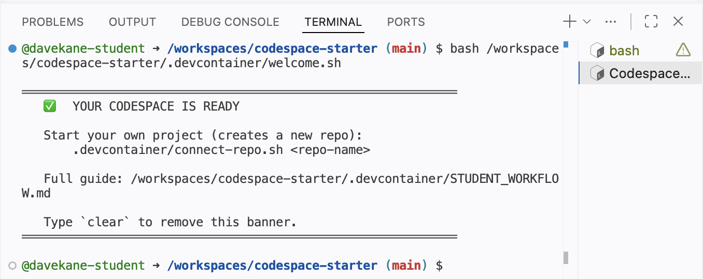
```

The GitHub name, `fictional winner`, now appears next to the repo name as well as in the quick access window above the editor. Your name will be different, as GitHub assigns a unique name to each Codespace.

### Touring the workspace {.unnumbered}

VS Code is an integrated development environment (IDE) for coding and data science. Highlights:

* This Codespace is in the cloud. The URL will be a combination of the GitHub-determined human-readable but somewhat nonsensical name — `fictional winner` in this case — and a bunch of letters and numbers. There is no need to remember this URL. GitHub keeps track of things. You can see all your current Codespaces at [`https://github.com/codespaces`](https://github.com/codespaces).

* In the upper right-hand corner are the "Customize Layout ..." buttons. These are part of the VS Code "Title Bar." Since we aren't using the AI tools right now, it often makes sense to close the "Chat" window, which appears on the right side of the screen. You can close this in two ways: Click the "X" mark or click the "Toggle Secondary Side Bar" button, the furthest right-hand button. You can then bring the Chat window back by clicking the "Toggle Secondary Side Bar" button again. Try it now.

```{r}
#| echo: false
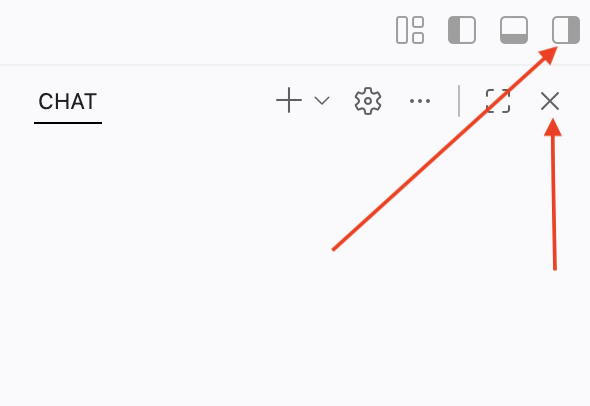
```

* The "Activity Bar" is the narrow vertical strip on the far left with icons for Explorer, Search, Source Control, Extensions, etc. By default, the "Explorer" button is selected, showing that the only thing in the project is a folder called `.devcontainer`. Click on that folder to show its contents.

```{r}
#| echo: false
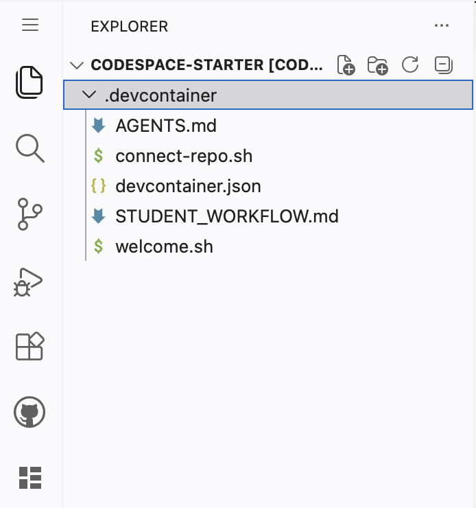
```

Click on the `STUDENT_WORKFLOW.md` file. Doing so opens that file in the Editor window. Your screen should now look like this:

```{r}
#| echo: false
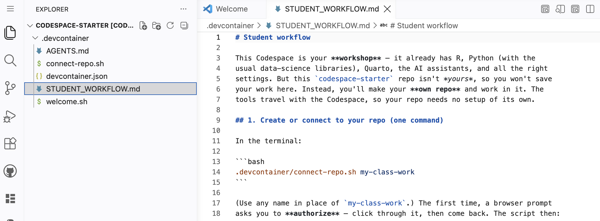
```

The "Editor" is the large central area where you edit files.

The "Panel" is the horizontal area below the Editor, containing the Problems, Output, Debug Console, Terminal, and Ports views. Our main focus is the Terminal view. This is where we "talk" to both the (cloud) computer itself and to the R program that it provides.

```{r}
#| echo: false
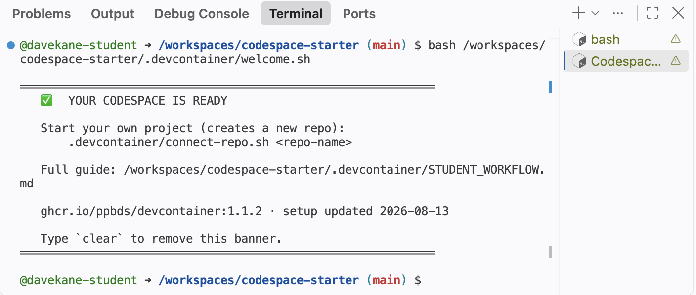
```

 The Terminal view currently shows two terminals. They are listed along the right-hand side. You can move back and forth between them by clicking on them. You can close a terminal by clicking on the trash can icon next to its name, which appears when you hover your cursor over the name.

```{r}
#| echo: false
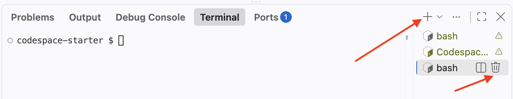
```

* You can start new bash Terminals by clicking on the `+` sign above the list of terminals. Do so now.

```{r}
#| echo: false
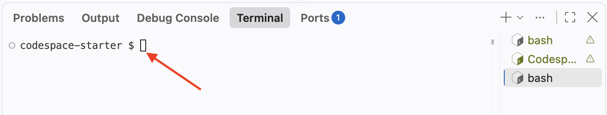
```

The language can be a little confusing. There is a capital T "Terminal" view, which is one of the tabs across the top of the Panel. In that Terminal view, we can work with many individual small T "terminals" of various sorts. So far, you have only seen bash Terminals, which get a capital T because they are a type of named terminal. The bash shell is a program that lets you "talk" to the computer itself.

In addition to bash Terminals, we can also start an R session under the Terminal. Instead of clicking the `+` sign, click the small downward-pointing arrow next to it. This will show a variety of options.

```{r}
#| echo: false
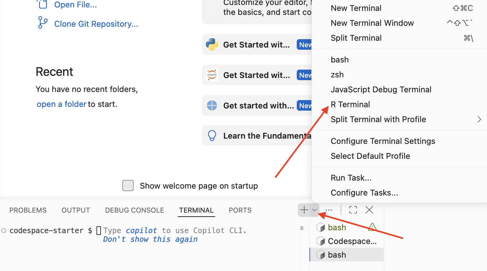
```

Select "R Terminal." This will start an R session that lets you "talk" to R in the same way that a bash shell allows you to talk to the computer.

Click on the "R Interactive" tab which should appear beneath the other terminals on the right side of the Panel.

Type in `2 + 2` at the R prompt and hit `enter` (Windows) or `return` (Mac). (Going forward we will just use `Enter` to refer to this action. Mac users should hit `return`.)

```{r}
#| echo: false
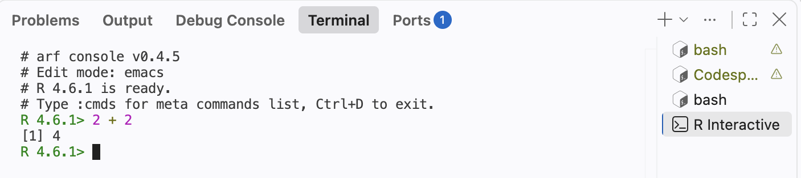
```

An IDE like VS Code is designed to organize all the different work we do as data scientists. We need to talk to the computer via the bash Terminal (a terminal running the bash shell), talk to R, view plots, and so on.

At the R Terminal, run `plot(1:10)`. We use the terms "run" and "execute" interchangeably. They both indicate that you should type the command at the appropriate terminal and hit `Enter`.

```{r}
#| echo: false
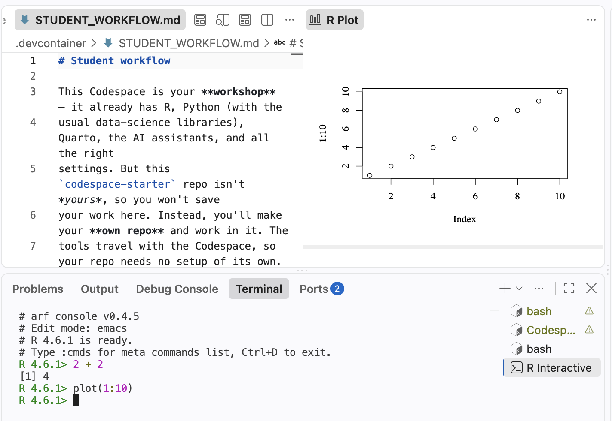
```

You have created a plot in the "Plots" tab of the Panel.

### Running the Getting Started tutorial {.unnumbered}

Earlier editions of this book sent you to the "R Tutorials" panel in VS Code to launch the `Getting Started` tutorial from the **[tutorial.helpers](https://ppbds.github.io/tutorial.helpers/)** package, which ran as a separate Shiny app inside your Codespace. This chapter instead walks you through that same tutorial directly on this page, powered by **[learnr2](https://ppbds.github.io/learnr2/)**: a version of the tutorial system that runs entirely in your browser, with no Shiny server required. Keep your Codespace open in another window -- you will switch back to its bash Terminal for one of the exercises below.

#### Introduction {.unnumbered}

This tutorial teaches you how tutorials work. There are only three steps: tell us who you are, run a command in a Terminal and copy the result, and download a copy of your answers. It should take about five minutes. Every tutorial you complete after this one uses the same sequence.

Most tutorials begin by asking for your name and email. Your instructor might also ask you to fill in the "ID" field so that your work can be matched to a grading database. If not, leave the "ID" field blank. Fill in the fields below and click **Submit**. Your answers save automatically as you type, so don't worry about getting them exactly right the first time -- clicking back into a field and changing it updates what's saved, mistakes included.

If you are completing this tutorial as part of a class, use the same email address for every tutorial.

```{r}
#| label: running-the-getting-started-tutorial-1
#| echo: false
learnr2::student_info()
```

#### The bash Terminal {.unnumbered}

Tutorials include exercises. Most exercises ask you to run a command in a terminal and then copy the result into the answer box below. You will do that once now.

Look at the bottom of your VS Code window. The horizontal area below the editor is called the "Panel." The red arrow below points to the new-terminal plus button (`+`) on the right side of the Panel.

```{r}
#| echo: false
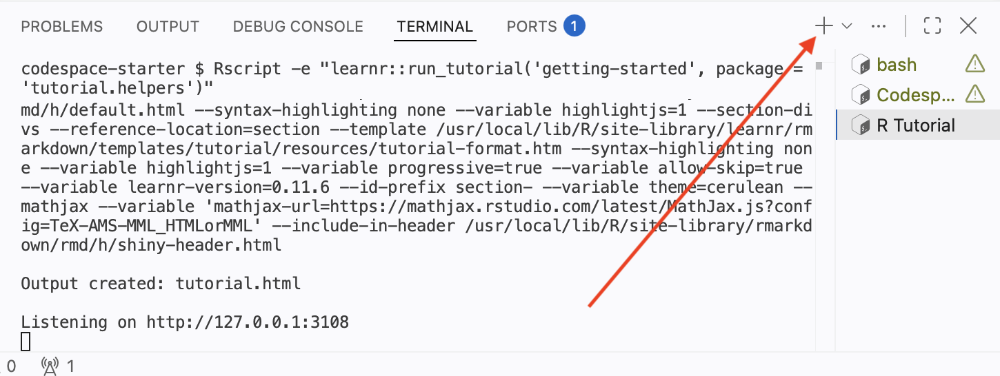
```

Press `+`. This opens a new **bash** Terminal -- the text-based interface in which you type commands to tell your Codespace what to do. The pattern is always the same: you send a command, the terminal executes it, and it gives you something back.

##### Exercise 1 {.unnumbered}

Click into the bash Terminal, type `pwd`, and then press `Enter`. To "run" a command means to type it and then press this key.

```{r}
#| echo: false
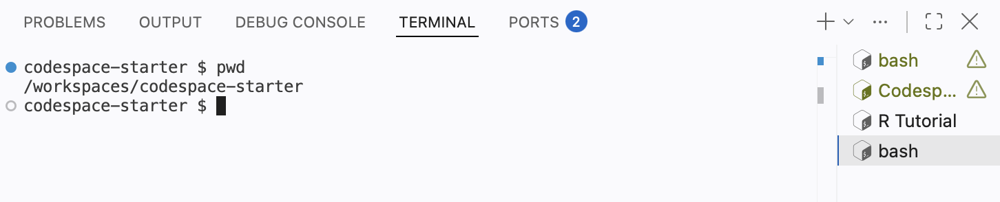
```

**Do not just type the command into the answer box!** You must run the command in the bash Terminal and then copy the result.

**C**opy and **P**aste both the **C**ommand *and* the **R**esponse from the bash Terminal into the box below. We abbreviate this instruction throughout the book as **CP**/**CR**.

```{r}
#| label: running-the-getting-started-tutorial-2
#| echo: false
learnr2::question(
  "Paste, into the box below, both the command you ran and the response the Terminal printed.",
  type = "reflection_editable"
)
```

We typically provide example answers, like the one below, after you submit your own response. Do not be concerned if your answer differs from the example we show.

````
codespace-starter $ pwd
/workspaces/codespace-starter
codespace-starter $
````

`pwd` stands for **p**rint **w**orking **d**irectory: it shows the directory in which the terminal is working. The response confirms that you are inside your Codespace, a complete computer running in the cloud. It is OK if your formatting differs from ours. What matters is that you show that you ran the command as instructed.

That is the usual process: run something in a terminal, copy the command and the response, paste them into the answer box. Almost every exercise in every later tutorial works this way.

##### Exercise 2 {.unnumbered}

Every answer on this page, including the one you just gave, is saved to your browser as you go -- not only once you finally download your work. Reload this page right now to see for yourself: your name, email, and the answer above should all still be there, exactly as you left them.

This is one way the **[learnr2](https://ppbds.github.io/learnr2/)** version of this tutorial differs from the Shiny-based one: there, quitting the underlying R session (with `Ctrl + C` in the "R Tutorial" terminal) still preserved your answers, but you had to explicitly restart the tutorial to see it. Here there is no R session running in your Codespace at all -- your answers live in your browser, not on a server, so nothing about your Codespace needs to stay open for your progress to be safe. There is also a "Start Over" button at the bottom of the sidebar if you ever want to clear your answers and begin again, which only acts after you confirm.

#### Your answers {.unnumbered}

At the end of every tutorial, you download a copy of your answers. First, answer the question below about how many minutes you spent on the tutorial. Then click the button below that to gather every answer on this page into a single file and download it.

```{r}
#| label: running-the-getting-started-tutorial-3
#| echo: false
learnr2::question(
  "How many minutes, approximately, did it take you to complete this
  tutorial? For example, an hour and a half would be 90 minutes.",
  type = "reflection_editable",
  validate = "integer"
)
```

```{r}
#| label: running-the-getting-started-tutorial-4
#| echo: false
learnr2::download_answers_button(filename_prefix = "getting-started-2")
```

After clicking the "Download My Answers" button, you will be prompted to save a file whose name starts with `getting-started-2`, followed by a timestamp. By default, this file will be saved in the `Downloads` folder on your computer. This action only downloads the file; it does not send the file to anyone.

Unless your instructor tells you otherwise, send them this file as-is (for example, attached to an email or uploaded to your course's learning management system).

### Stopping, restarting and deleting the Codespace {.unnumbered}

A Codespace is your responsibility in the same way that your laptop is your responsibility. While a Codespace is running it counts against your free hours, and an unused Codespace will be deleted by GitHub after 30 days.

There are three common ways to close a Codespace.

First, just leave it alone. GitHub will close it on its own after 30 minutes of inactivity, though we recommend changing that default to 15 minutes in your [Codespaces settings](https://github.com/settings/codespaces).

Second, type `Cmd/Ctrl + Shift + P`. The Command Palette provides access to all VS Code commands. Type `stop` into the search bar.

On some browsers, the keyboard shortcut does not work. You can always access the Command Palette by clicking the search bar at the top of the window and typing `>` followed by key words from the command you would like to use.

```{r}
#| echo: false
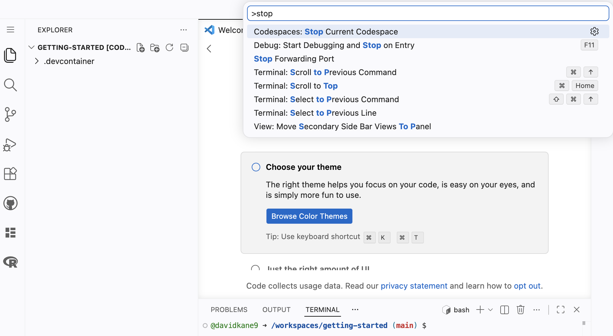
```

Select "Codespaces: Stop Current Codespace."

Third, you can go to your personal Codespaces control panel at [`https://github.com/codespaces`](https://github.com/codespaces). You can also reach this page from any page on GitHub by clicking the menu icon in the upper left and selecting "Codespaces":


```{r}
#| echo: false
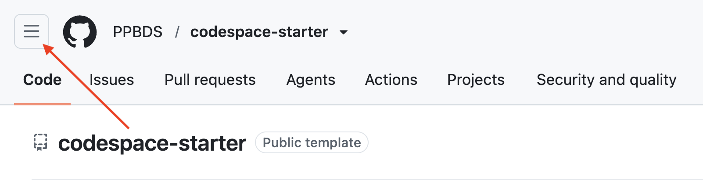
```

Which brings up this lst of options. Select "Codespaces."

```{r}
#| echo: false
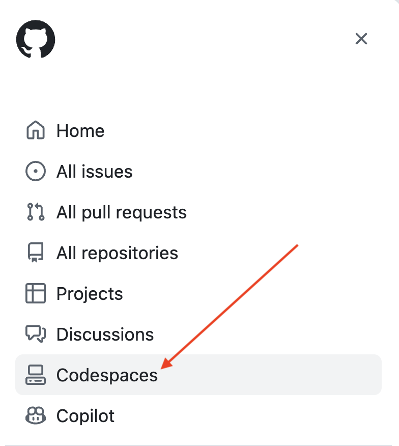
```

You main Codespaces page should look something like this:

```{r}
#| echo: false
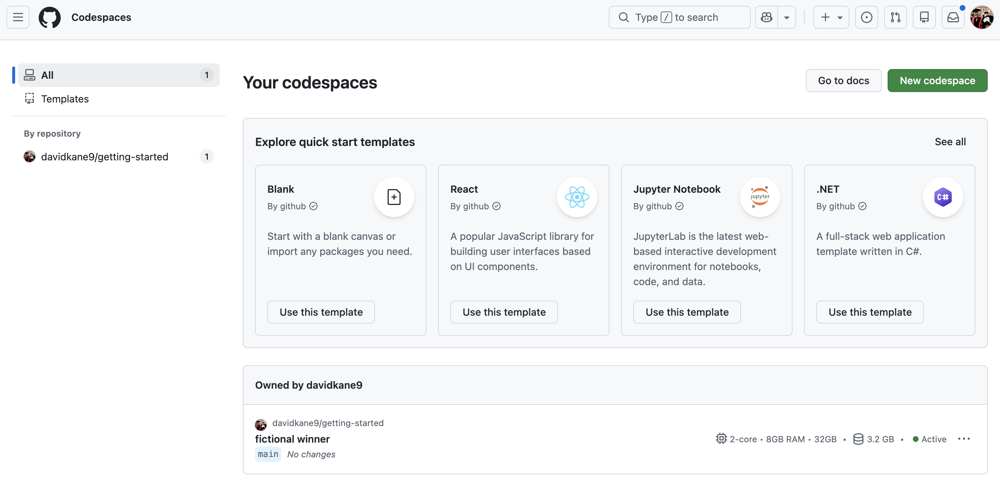
```

This shows all your Codespaces, both active and inactive. The `...` menu on each row provides several commands, including "Stop Codespace."

```{r}
#| echo: false
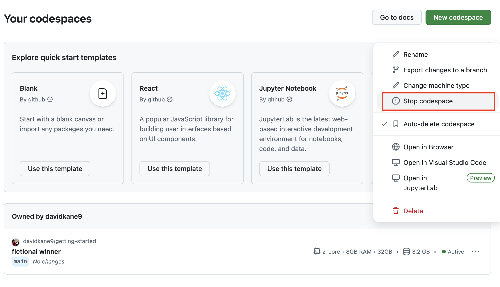
```

Simply closing the browser window *does not* stop your Codespace from running. Always stop a Codespace explicitly to preserve your free hours.

Now stop this Codespace using whichever method you prefer.

Once it is stopped, you can restart it from your [Codespaces page](https://github.com/codespaces) by clicking the `...` menu next to this Codespace and then selecting **Open in Browser**.

```{r}
#| echo: false
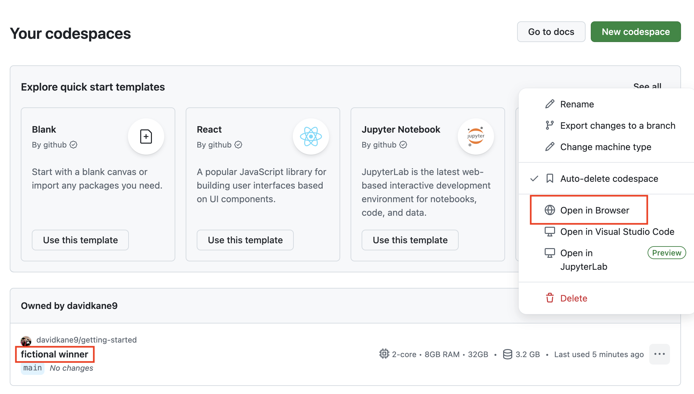
```

Once you are done with a Codespace, you should **delete it.** To do so, go to your [Codespaces page](https://github.com/codespaces), click the `...` menu next to this Codespace and select **Delete**.

This Codespace was a sandbox. You do not own [`PPBDS/codespace-starter`](https://github.com/PPBDS/codespace-starter), so there is nowhere for your work to go once you stop using the Codespace. That is fine — you have already downloaded your tutorial answers, which is the only thing here worth keeping.

## Using your own machine

You can do all of this work on your own laptop, if you prefer. But, in that case, you are responsible for setting everything up. That means installing VS Code, Git and R. You will almost certainly want to install the same VS Code extensions which we use, including:

```
"reditorsupport.r",
"quarto.quarto",
"PPBDS.vscode-r-tutorials",
"ritwickdey.LiveServer",
"tomoki1207.pdf",
"mechatroner.rainbow-csv"x
```

This listing is from  the `.devcontainer/devcontainer.json` file from [`PPBDS/codespace-starter`](https://github.com/PPBDS/codespace-starter). You may also find it useful to use the same VS settings which are defined there.

You will also need to install, by hand, various R packages. From the R Terminal, you would run commands like:

```
install.packages("pak")
```

You may be asked to select a CRAN mirror. It does not matter which you choose.

```
pak::pak("tidyverse")
pak::pak("PPBDS/vscode.tutorials")
```

These steps are not enough to perfectly replicate what we show in the Codespace. See `PPBDS/devcontainers` for more details.

But this should be enough to get you started, should you decide to go this route. If you have trouble, ask AI, pointing it toward this chapter and to the [`PPBDS/codespace-starter`](https://github.com/PPBDS/codespace-starter) and `PPBDS/devcontainers` repos.

## Summary {.unnumbered}

You should have done the following:

- Signed up for a GitHub account.
- Used a throwaway Codespace on [`PPBDS/codespace-starter`](https://github.com/PPBDS/codespace-starter) to complete the **Getting Started** tutorial right here on this page, powered by **[learnr2](https://ppbds.github.io/learnr2/)**, downloaded your answers, then **deleted** the Codespace.

For doing some tutorials, a throwaway Codespace is all you need: complete the tutorial and download your answers --- no repository needed. When a later tutorial asks you to keep your work and build on it, the next chapter, [Git and GitHub](git-and-github.qmd), shows you how to create a repository you own.

Let's get started!

```{r}
#| echo: false

```
