# Getting Started {.unnumbered}

*You can never look at the data too much.* -- Mark Engerman

The world confronts us. Make decisions we must.

We provide two different computing approaches for doing data science: first, working in the cloud using GitHub Codespaces with Visual Studio Code (VS Code) and, second, using your local machine with Positron.

## GitHub Codespaces with Visual Studio Code  {.unnumbered}

### GitHub  {.unnumbered}

Sign up for a GitHub account by following the instructions at the [GitHub homepage](https://github.com/). **Follow [this advice](https://happygitwithr.com/github-acct.html#username-advice) when choosing your username.** 

Use a permanent email address for this account — not one tied to your current school or job, which you'll lose access to when you move on. Your GitHub account is for life; your school email isn't.

If you're a current student, you can still qualify for the [GitHub Student Developer Pack](https://education.github.com/pack) (free Copilot, extra Codespaces hours, and 100+ other perks). After signing up, add your school email as a secondary email in your GitHub settings and apply for Education benefits — you don't need to use the school email as your primary account email. If your school doesn't issue email addresses, you can also apply by uploading a student ID or enrollment letter.

On GitHub, your projects are organized into "repositories," usually called "repos."

### Starting a codespace  {.unnumbered}

Instead of working on your computer, you will work in a [GitHub codespace](https://github.com/features/codespaces).

Once you are logged on to your GitHub account, go to [this URL](https://github.com/PPBDS/codespace-starter) in your browser:

`https://github.com/PPBDS/codespace-starter`

```{r}
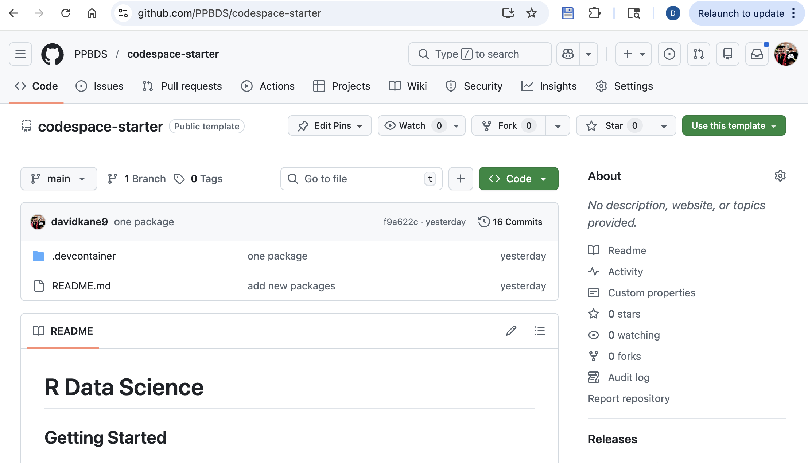
```

You can also create your own codespace from scratch. But, since this is all very new, we have created the basic setup files, mainly `devcontainer.json`, in a sensible fashion in this GitHub repository. In particular, we ensure that R is installed along with some important packages and some useful extensions for VS Code.

Click the green "Use this template" button in the upper right. Select the "Create a new repository" option.

```{r}
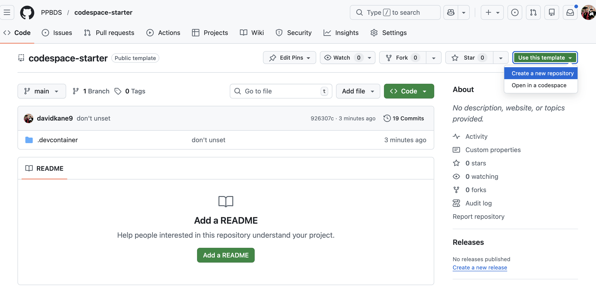
```

GitHub takes you to the next screen, where you can name the new repository. This repository will be a copy of the `PPBDS/codespace-starter` repo, but it will be under your control because it is located in your GitHub account rather than the `PPBDS` account. Note the `davidkane9` in the screenshot, which is my GitHub account.

Use `getting-started` as the name of the new repository. Click the green "Create repository" button.

**When completing tutorials, you should usually give the repo the same name as the tutorial you are working on.**

This chapter has two purposes: first, introduce you to GitHub Codespaces and VS Code and, second, help you complete the Getting Started tutorial.

The next screenshot shows that you are now on your GitHub account, about to create the `getting-started` repo. 

```{r}
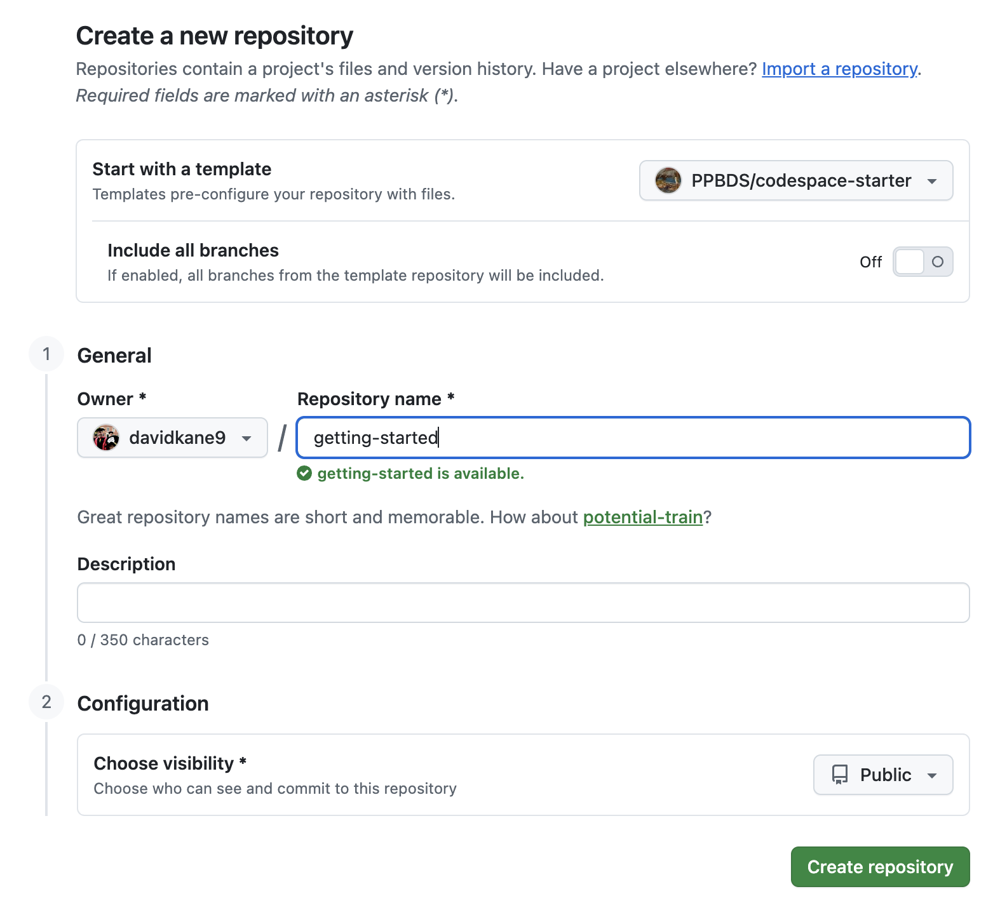
```

After clicking the green "Create Repository" button, your screen should look like the one below. Click on the green "Code" button. It shows two options: "Local" and "Codespaces." You use "Local" if you want to work on your own machine. Select "Codespaces" to work in the cloud.


```{r}
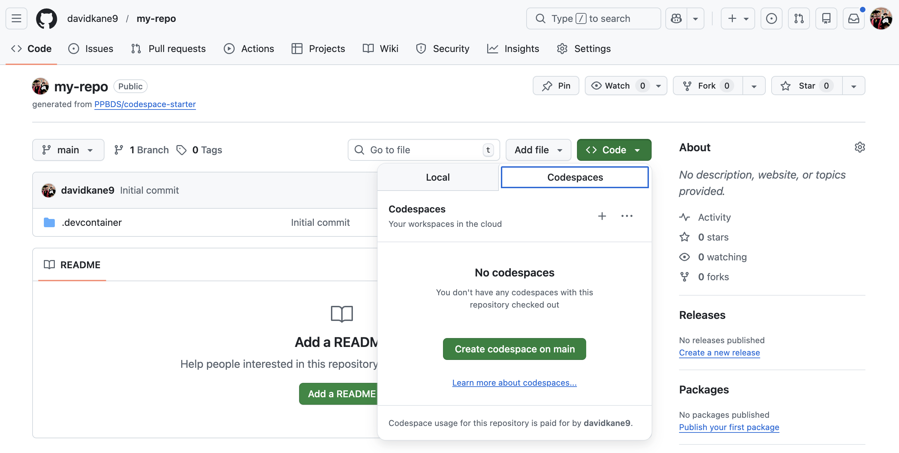
```

Click on the green "Create codespace on main" button.

This will take a few minutes to run. Read the rest of this chapter while you are waiting. Behind the scenes, GitHub is creating a virtual machine in the cloud with all the necessary tools for doing data science. That machine is called a "codespace." 

You can tell that the codespace is not ready by noticing the "Setting up remote connection: Building codespace..." message in the lower right. GitHub is creating a codespace following the instructions in the `devcontainer.json` file located in the `.devcontainer` directory.

```{r}
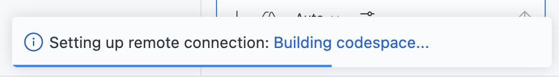
```

When that message disappears, it means that your codespace is built. But you still need to connect to it, as indicated by the "Opening remote" message in the lower left. 

```{r}
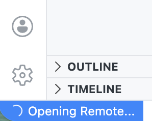
```

Once that disappears, you are connected to your codespace, but it usually still has a few things to install. You can tell that it is not finished by looking in the upper left. 

```{r}
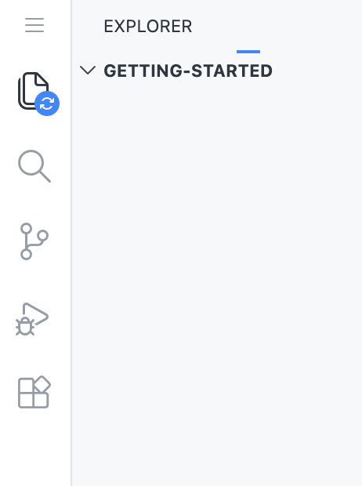
```

First, note the blue dash moving above the repo name. That indicates that the process is not complete. Second, only the five default "extensions" appear along the left edge. Our `devcontainer.json` file installs several more at the end. Third, the codespace is not displaying its GitHub assigned name. The process is complete when your codespace looks like this:  

```{r}
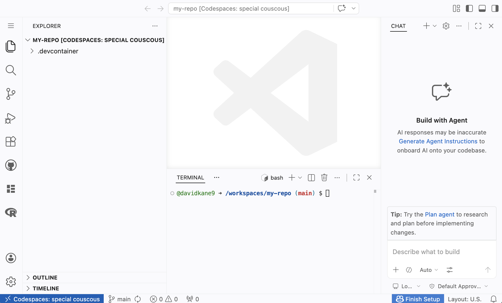
```

The blue dash has disappeared. Several more extensions have been installed. The GitHub name, `fictional winner`, now appears next to the repo name as well as in the quick access window above the editor.


### Closing a codespace  {.unnumbered}

GitHub allows 60 hours of free Codespaces usage each month, and probably more if you join [GitHub Education](https://github.com/education), an option that we highly recommend for students. It also provides for lots of free storage. However, if you want to avoid paying, you need to be aware of your usage.

A codespace is your responsibility in the same way that your laptop is your responsibility.  An unused codespace will be deleted after 30 days.

There are three common approaches to close codespaces.

<!-- AR: Should we highlight that closing the browser viewing the Codespace does not stop the codespace from running? I feel like this is potentially confusing. -->

First, just leave the codespace alone and it will close on its own. GitHub monitors codespaces. By default, it will close your codespace if it is not being used for 30 minutes, although I recommend changing that default to 15 minutes.

<!-- AR: in Firefox on Mac, 'Cmd + Shift + P' opens a private window and doesn't trigger Command Palette. Add that Command Palette can be accesses by typing '>' into the Command Palette to search and run commands? -->

Second, type `Cmd + Shift + P` (on Mac) or `Ctrl + Shift + P` (on Windows/Linux) to bring up the Command Palette. (Throughout this book, shortcuts are written like `Cmd/Ctrl + Shift + P`, meaning the `command` key on Mac or the `control` key on Windows/Linux.) The Command Palette provides access to all of the VS Code commands. Type `stop` into the search bar. 


```{r}
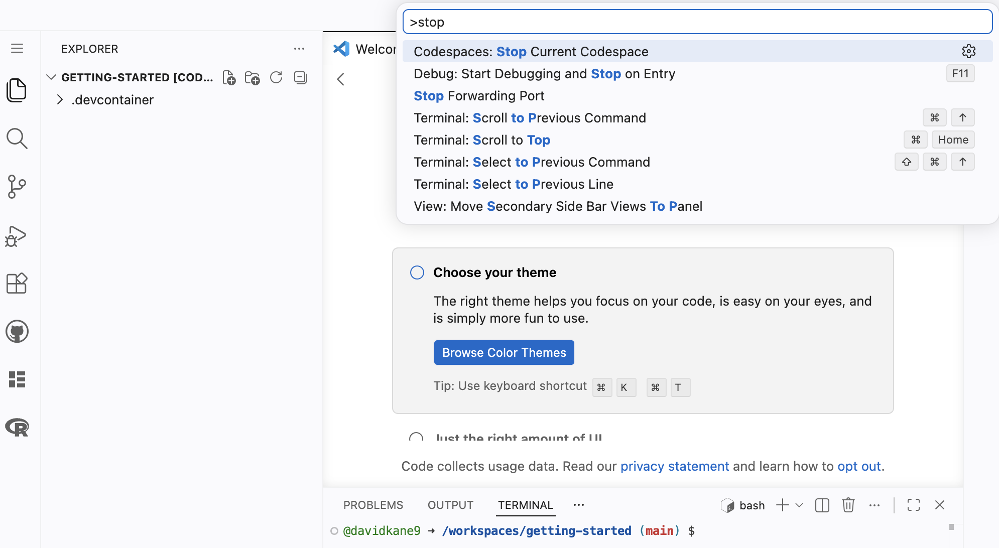
```


Select "Codespaces: Stop Current Codespace." Note how search in the Command Palette works. As long as you remember at least one of the words in the command you are looking for, it will find that command. Searching for general topics, like "codespace" also works well. 

Third, you can go to your main codespace control panel at `https://github.com/codespaces`.

```{r}
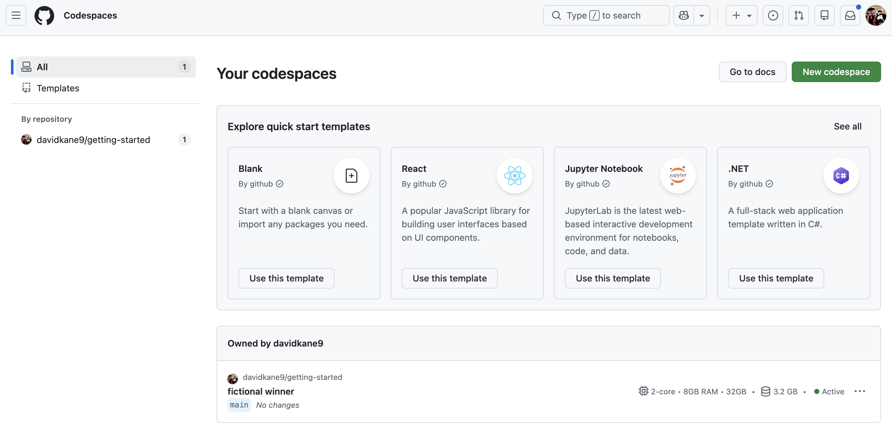
```

This will show all your codespaces, both active and inactive. The `...` to the lower right provide several common commands, the most relevant for us now being "Stop codespace." Selecting that button is the third way to stop a codespace.

<!-- Could add some red arrows to the Active and Last active information in the lower left, along with discussion. -->

```{r}
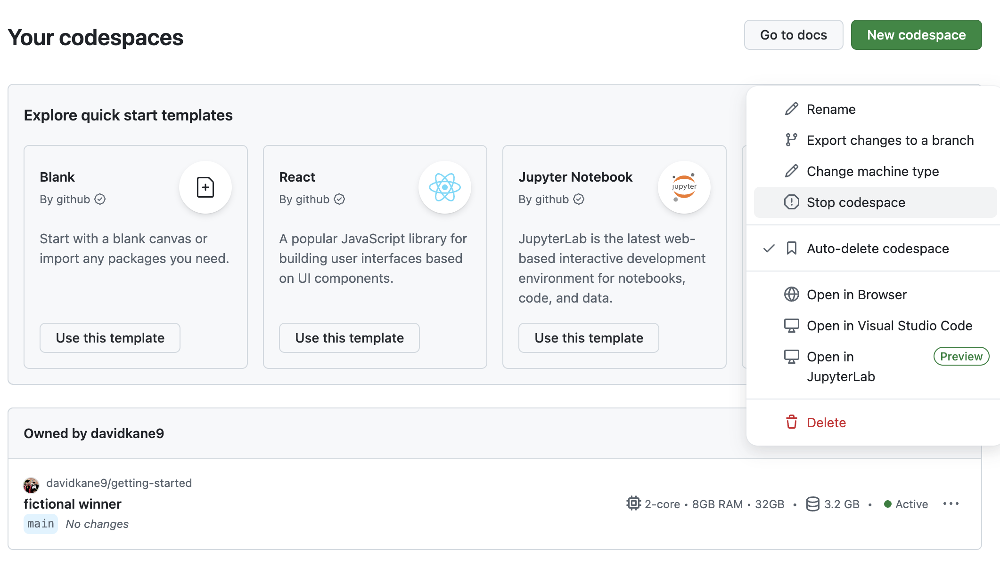
```

You can restart a codespace from the same location. The set of commands brought up by clicking on `...` is slightly different now. Selecting "Open in browser" restarts the codespace.


```{r}
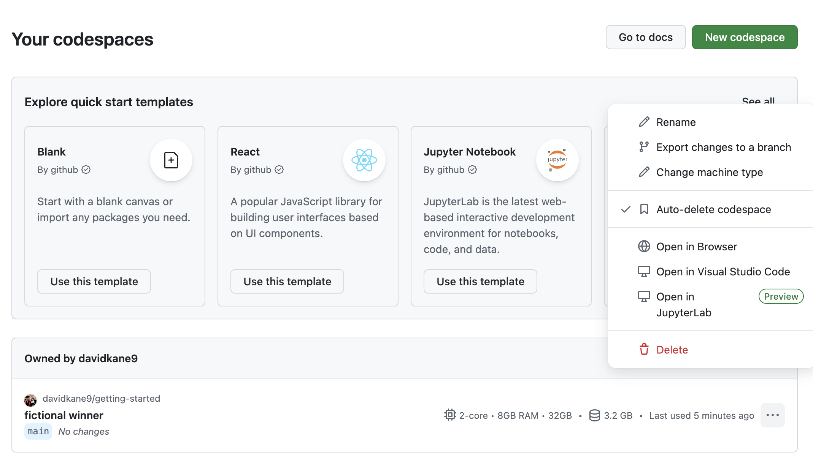
```


### Using a codespace  {.unnumbered}


Visual Studio Code, also known as "VS Code," is an integrated development environment (IDE) for coding and data science. Highlights:

* This codespace is in the cloud. The URL will be a combination of the GitHub-determined human-readable but somewhat nonsensical name--`fictional winner` in this case--and a bunch of letters and numbers. There is no need to remember this URL. GitHub keeps track of things. You can see all your current codespaces [here](https://github.com/codespaces).

* In the upper right-hand corner are the "Customize Layout ..." buttons. These are part of the VS Code "Title Bar." Since we aren't using the AI tools right now, it often makes sense to close the "Chat" window, which appears on the right side of the screen. You can close this in two ways: Click the "X" mark or click the "Toggle Secondary Side Bar" button, the furthest right-hand button. You can then bring the Chat window back by clicking the "Toggle Secondary Side Bar" button again. Try it now.

```{r}
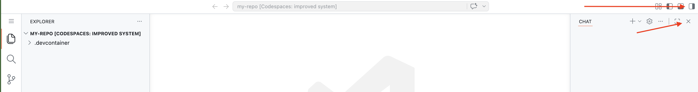
```

* The "Activity Bar" is the narrow vertical strip on the far left with icons for Explorer, Search, Source Control, Extensions, etc.  By default, the "Explorer" button is selected, showing that the only thing in the project is a (hidden) folder called `.devcontainer`. Click on that folder to show its contents.

<!-- DK: Could put in a bunch more images . . . -->

```{r}
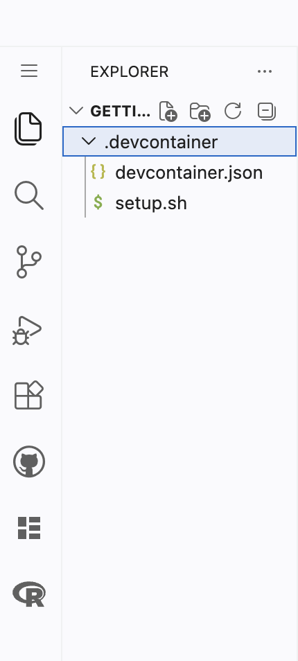
```

Click on the `devcontainer.json` file. Doing so opens that file in the Editor window. Your screen should now look like this:

```{r}
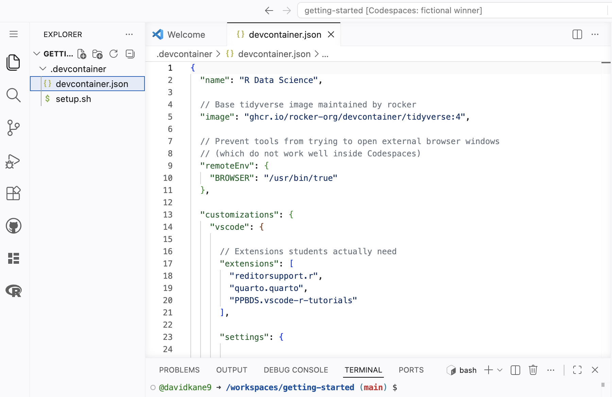
```


* The "Editor" is the large central area where you edit files. 

* The "Panel" is the horizontal area below the Editor, containing the Terminal, Output, Problems, Debug Console, and Ports tabs. Our main focus is the Terminal tab. This is where we "talk" to both the (cloud) computer itself and to the R program that it provides. 

* The Terminal currently shows a "bash" shell. We will learn more about shells later. Click on the `+` sign to the right of the "Ports" tab. This will start a second bash shell. Your Panel should now look like this:

```{r}
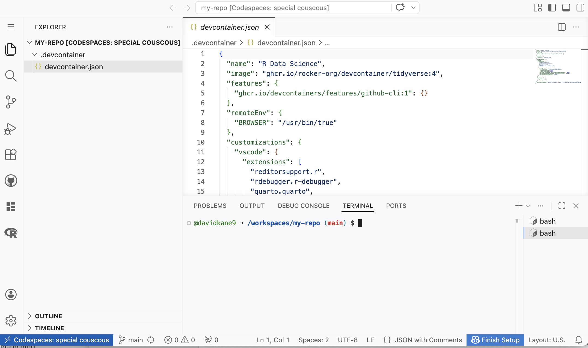
```

<!-- DK: Maybe close the codespace and open it again? -->

* Note the two bash shells on the right side of the Panel. We can click on each to move back and forth between them. 

* In addition to shells, we can also start an R session under the Terminal. Instead of clicking the `+` sign, click the small downward pointing arrow next to it. This will show a variety of options.

```{r}
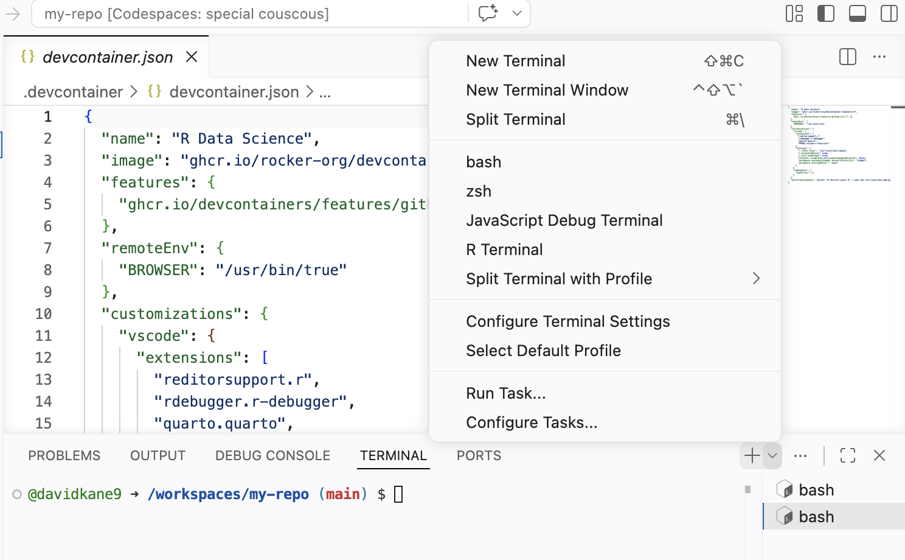
```

* Select "R Terminal." This will start an R session that lets you "talk" to R in the same way that a bash shell allows you to talk to the computer.

* Click on the "R Interactive" option which should appear beneath the two bash lines on the right side of the Panel.

* Type in `2 + 2` at the R prompt and hit `enter` (Windows) or `return` (Mac). (Going forward we will just use `enter` to refer to this action. Mac users should hit `return`.)

* Type in `plot(1:10)` at the R prompt. Hit `enter`. Your screen should look like:

```{r}
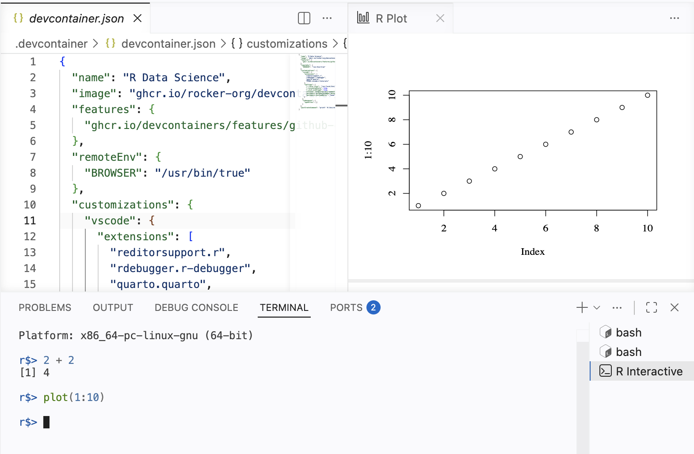
```

An IDE like VS Code is designed to organize all the different work we do as data scientists. We need to talk to the computer via the shell, talk to R, view plots, and so on.

### Tutorials {.unnumbered}

If you hover your cursor over the Activity Bar on the far lefthand side, you can see the names of the different options. The second from the bottom is labeled "R Tutorials." Click on it. (You might need to click twice.) This brings up all the R packages with tutorials. Click on the package name `tutorial.helpers`.

```{r}
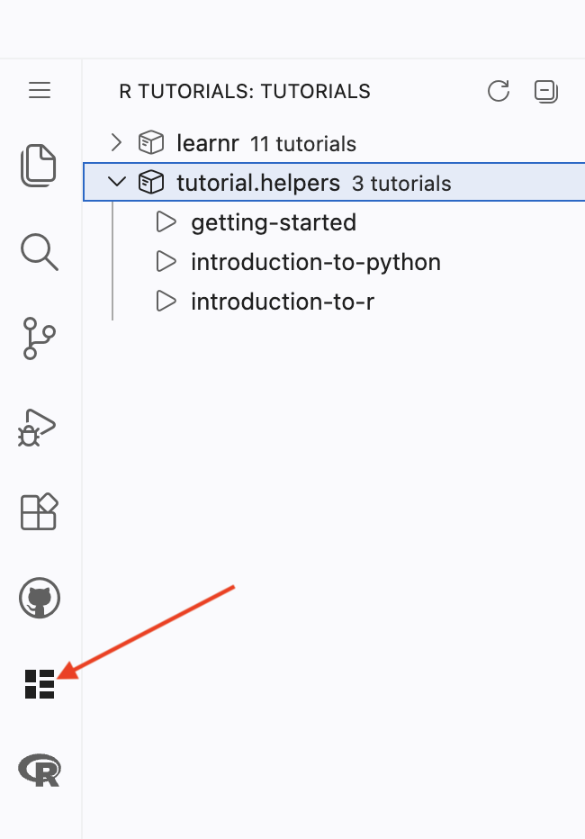
```

Doing so shows all the R tutorials which are in the `tutorial.helpers` package. If you hover your cursor over a tutorial, a rightward pointing arrow appears. Clicking that arrow starts the tutorial. Start the `getting-started` tutorial from the **tutorial.helpers** package. Do so now.

```{r}
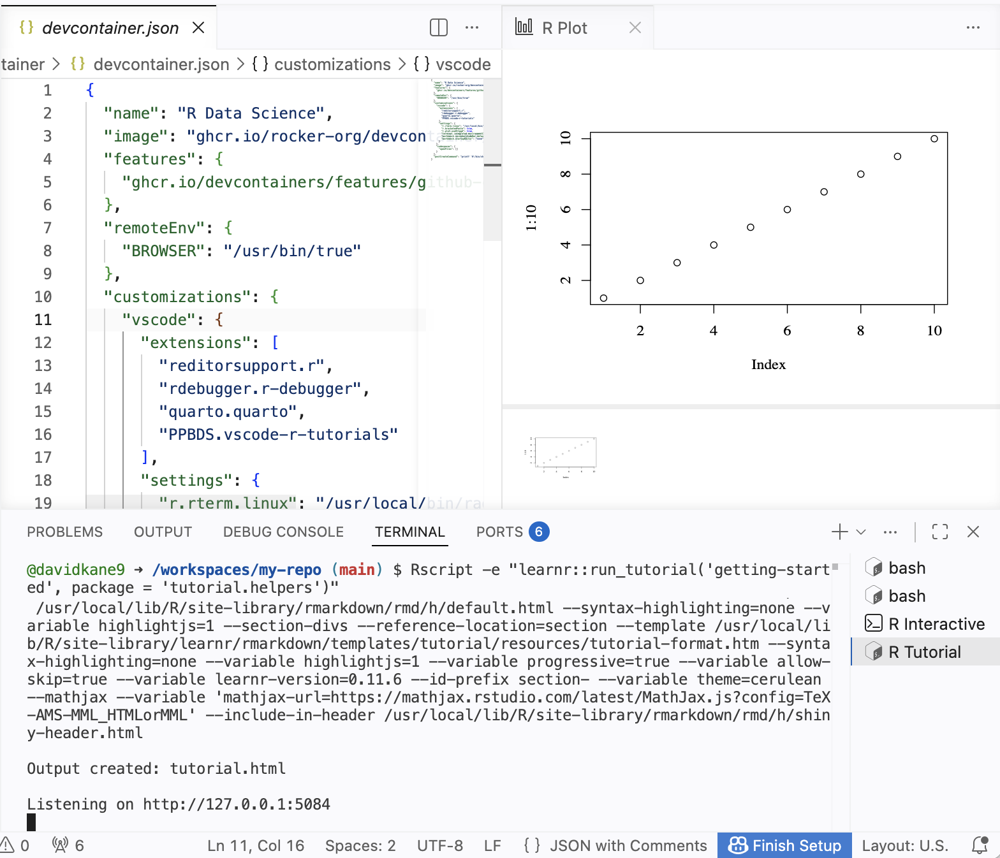
```

Clicking the tutorial arrow starts a new R session, labeled "R Tutorial" on the right side of the panel. We now have 4 different terminals: two bash and two R. In this case, a "terminal" is any connection to the (cloud) computer itself or two a program running on it, like R. In fact, the [bash shell](https://opensource.com/resources/what-bash) is just another program which runs in the computer. 

The R Tutorial session shows the tutorial being built and its current state, which is "listening," i.e., waiting for you to complete the tutorial.  While the tutorial is running, this R session is unavailable for other work.

You should also have been given an option to open the tutorial in the browser. You should take that option. If it does not appear, or if you missed it, you can also open the tutorial by hand:

```{r}
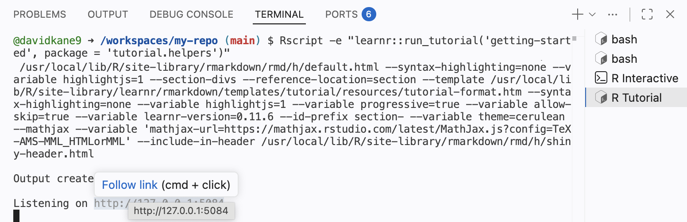
```

The `http` address refers to a file located in your GitHub codespace but which is still visible on your local machine via the magic of "port forwarding," meaning that the codespace is allowing your browser to open it. Opening it in your browser shows:

```{r}
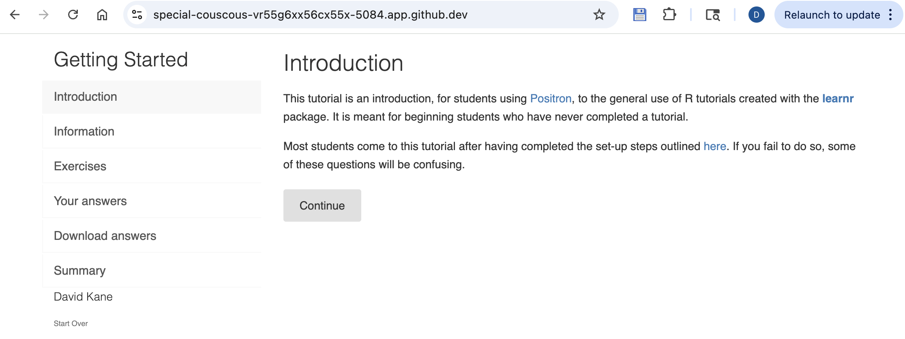
```

Read and follow the instructions. At the end of the tutorial, you should download your answers. 

### Stopping and deleting a codespace {.unnumbered}

<!-- AR: Some of this material is repeated from "Closing a Codespace Section" -->

You can see all your codespaces [here](https://github.com/codespaces). Although GitHub provides you with lots of free hours, "lots" is not endless. It is your responsibility to keep track of your usage. GitHub helps by stopping any codespace which has been inactive for 30 minutes. (You can change this default if you like by going [here](https://github.com/settings/codespaces) and updating Default Idle Timeout for your Github account. I use 15 minutes.)

Use 'Cmd + Shift + P' to open the Command Palette and type "stop" in the search bar. Select "Codespaces: Stop Current Codespace" to stop running the Codespace 

You can restart the Codespace anytime by going to your [codespaces page](https://github.com/codespaces):

```{r}
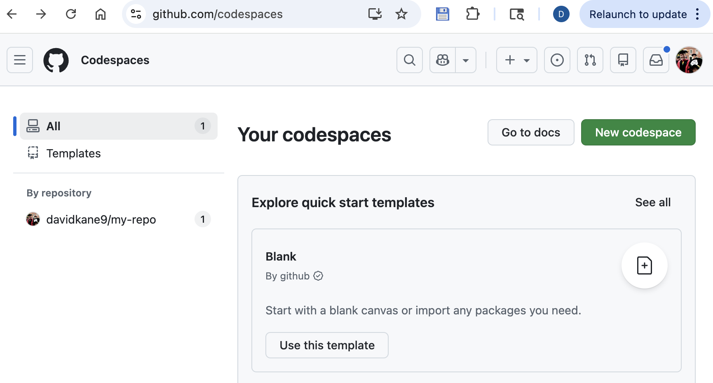
```

I only have one codespace. It was started from one of my repos, as we know. Selecting it, and also clicking on the three dots--`...`--in the upper left, we have some options:


```{r}
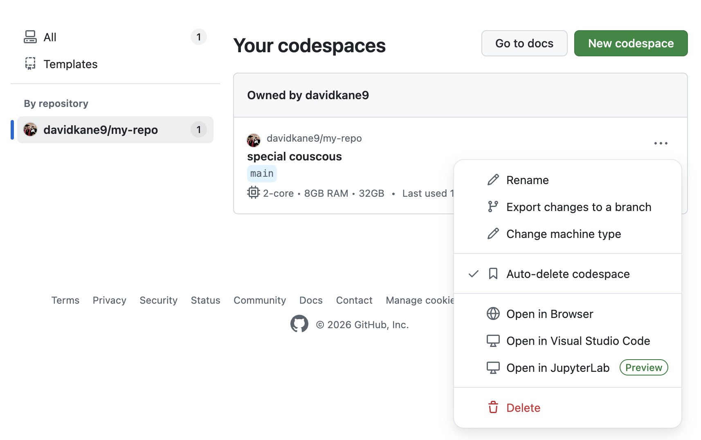
```

We can restart the codespace by selecting "Open in Browser." As you might expect, click on "Delete" deletes the codespace permanently.


Your data science journey begins now!

### Summary for cloud {.unnumbered}

You should have done the following:

  - Signed up for a GitHub account.

  - Created a codespace using https://github.com/PPBDS/codespace-starter as a template.

  - Completed your first tutorial.

  - Stopped and deleted the codespace.

Let's get started!

```{r}

```


<!-- 

Should our devcontainer set some sensible defaults for Git, especially with regard to automatic staging and the like?

Probably need to change the starting tutorial from Getting Started to Codespaces.

Note: if the codespace stops, you lose the R session. And other stuff?

Talk about, and show, how the Toggle button changed to all empty once we closed the chat window.

Consider simplifying the Terminal choices.

-->

## Local machine with Positron

As long as you have a not-too-old computer--almost always a Mac or Windows laptop--you can do data science locally, without going to the cloud. 

### Installing R and Positron {.unnumbered}

We use [**R**](https://www.r-project.org/about.html) via [**Positron**](https://positron.posit.co). R is to Positron as a car's engine is to its dashboard.

More precisely, R is a programming languages that runs computations, while Positron is an *integrated development environment (IDE)* that provides an interface with many convenient features. Just as having access to a speedometer and navigation system makes driving much easier, using Positron's interface makes working with R and Python much easier.

Download and install R and Positron on your computer.

1. [Download and install R](https://cloud.r-project.org/). If you are using a Mac, make sure to use the correct installation, depending on whether you are using newer "Apple silicon (M1,2,..) Mac" (first option) or "older Intel Macs" (second option). You can look up the chip used in your Mac by checking "About This Mac" under the Apple menu.

2. [Download and install Positron](https://positron.posit.co/download.html). If using a Mac, figure out if you should use the "arm64" (which is for the newer Macs) or "x64" version. If your Mac is not too old, you want "arm64." Avoid the universal installer.

3. If you are using Windows, you **must** also do two things:

  + Install [Git for Windows](https://gitforwindows.org/). 

  <!-- FYI: There is no way to avoid installing Git Bash when you use Git for Windows. -->

  + Install RTools. See [here](https://cran.r-project.org/bin/windows/Rtools/) for the latest version. Currently, the Rtools45 installer is what you want, assuming that your installed R version is at least 4.5.0. The link is in the seventh paragraph of [this page](https://cran.r-project.org/bin/windows/Rtools/rtools45/rtools.html). Use your favorite AI to help determine whether to use the Rtools45 installer or 64-bit ARM Rtools45 installer. Again, this is not required, but if you have problems installing packages later in this chapter, you **must** install RTools. If not, you are all set.

<!-- Advice about Workbench? -->

### The Console {.unnumbered}

Much as we don't drive a car by interacting directly with the engine but rather by interacting with elements of the car's dashboard, we won't be using R directly. Instead, we will work through Positron's interface. After you install R and Positron on your computer, you'll have two new *programs* (also called *applications*) you can open. Always work in Positron, not directly in the R application.

Open up Positron. 

```{r}
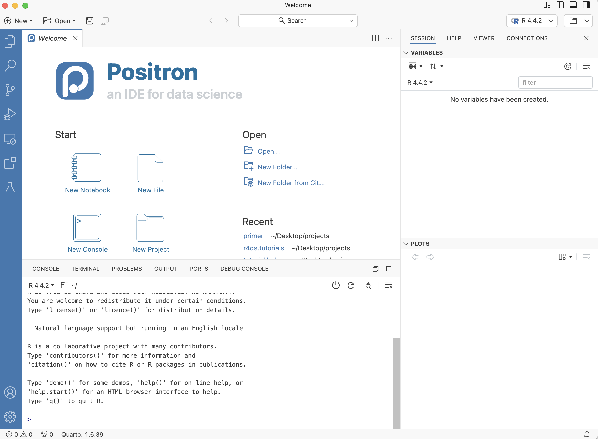
```

Look at the Console tab in the Panel at the lower left. At start up, the Console gives you some information about your version of R. The Console is where you can type and run R code. For example, if you type `1 + 1` and hit `enter` (on Windows) or `return` (on Mac), the Console returns 2. 

We often use the phrase "run the following code." This means that you should type or copy-and-paste the code into the Console and then hit the `Enter` key. (Note that `return` is the name of a Mac key and `enter` the name of the corresponding Windows key. We use `Enter` throughout the *Primer* to refer to both.)

The right side of the Positron window is the Secondary Side Bar.

```{r}
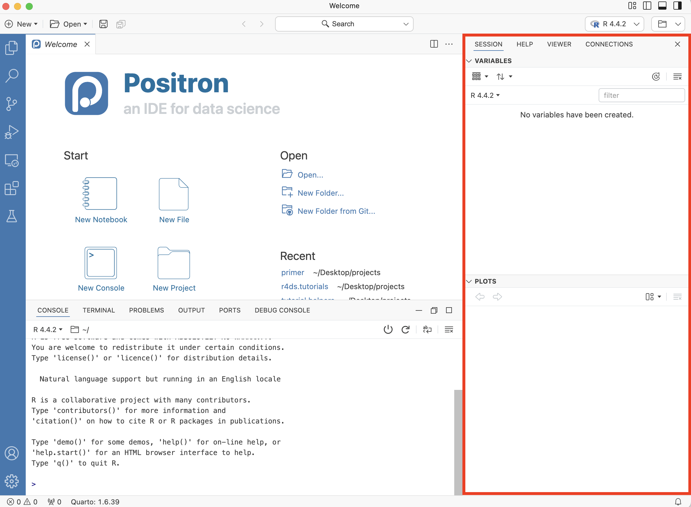
```

In the Session tab, there is a Variables listing for the current R session. There are no variables yet. Let's change that. Go to your Console and type:

```{r}
#| code-fold: false
x <- 5
```

This code assigns the value 5 to an object, `x`. `<-` is the operator used to assign values to objects in R. Now, hit `Enter` and you should see a variable `x` equal to 5 under Values. You must always hit `Enter` after typing a command, otherwise Positron will not realize that you want R to execute the command.

```{r}
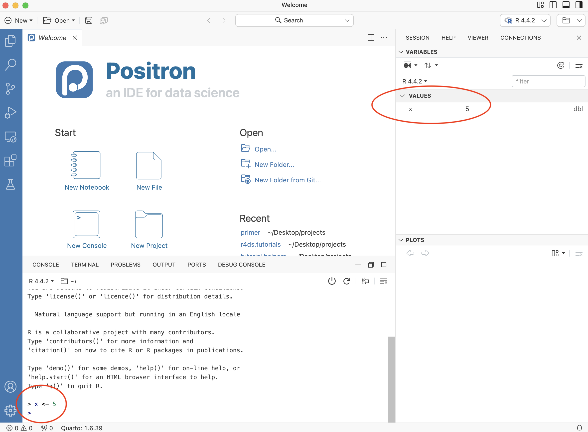
```

The Secondary Side Bar contains different tabs in the top half and a display area for plots in the bottom half. 

```{r}
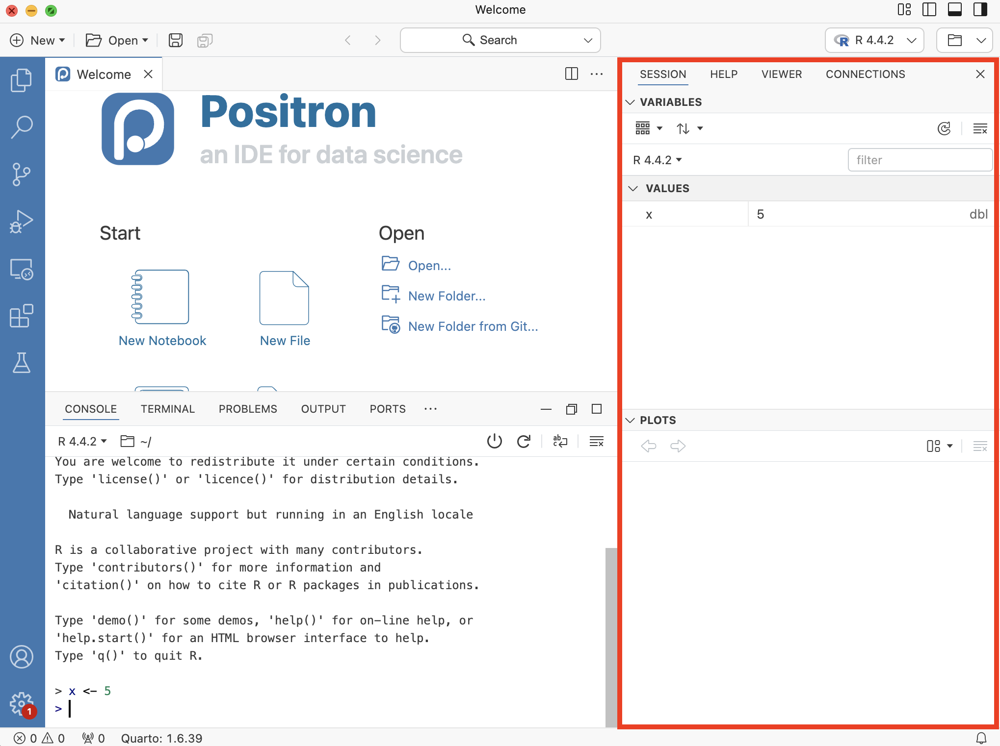
```

In the Console, type `plot(1:10)` and hit `Enter`.

```{r}
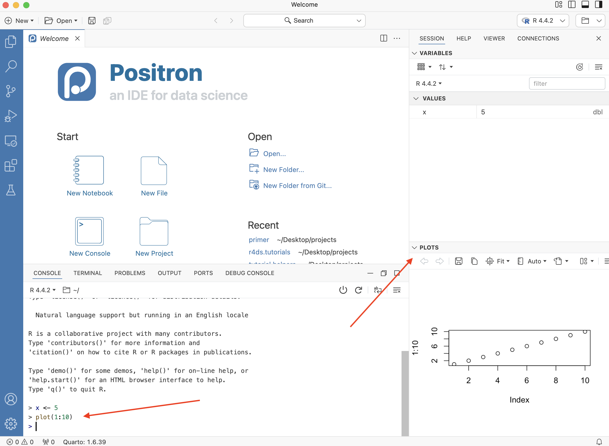
```

The far left of the Positron window is the Activity Bar. The area in which the Welcome screen is currently located is the Editor. Once you start writing code, the Editor is the location in which your files will appear.

### The Terminal {.unnumbered}

The Console is where we talk to R. The Terminal is where we talk to the computer. The Console behaves almost identically regardless of the kind of computer you use. The Terminal, sadly, is different for Windows versus Mac. Next to "Console" on the Panel menu is "Terminal." See the red oval below. Click on the word "Terminal" to access it.

```{r}
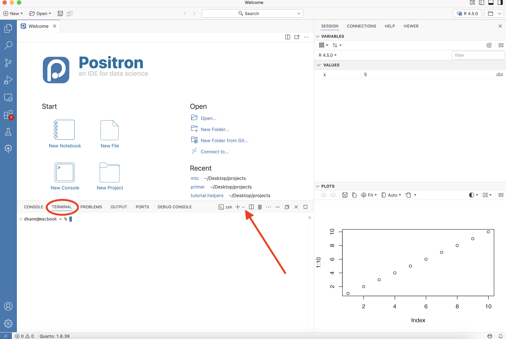
```

`dkane@macbook ~ % ` is the "prompt," the place where we type commands, just like `>` in the Console. Your prompt will be different from mine, especially if you are using Windows. 

We often want a new Terminal with a different "shell," the program which serves as the interface between you and the computer. On a Mac, the default shell is referred to as "[Unix-like](https://en.wikipedia.org/wiki/Unix-like)" since it acts very much like the traditional Unix command line. In Windows, the default shell is [PowerShell](https://en.wikipedia.org/wiki/PowerShell), an older technology which is not worth learning. To start a new Terminal with a specific shell, press the downward arrow next to the `+` sign. This is the "Launch Profile ..." arrow. See the red arrow above.

```{r}
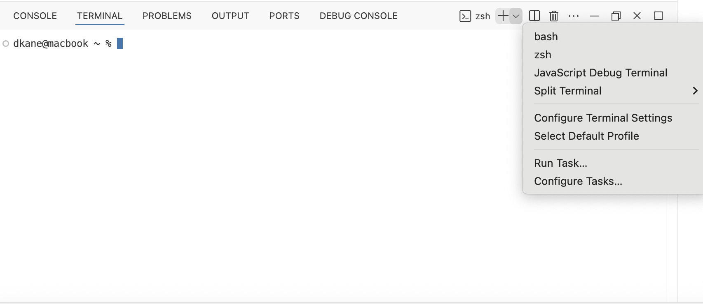
```

If you are using Windows, you should see an option for "Git Bash" (or maybe just "bash"), at least if your have installed Git for Windows as we told you to do above. If you did, and you don't see a bash option, try restarting Positron.

With luck, bash will also be the default every time you open the Terminal on Windows. But, if not, you should select it by hand. One way to make it the default choice is to use the "Select Default Profile" tool:

```{r}
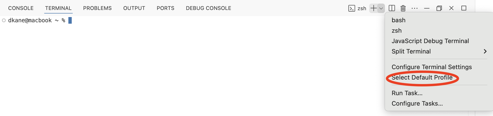
```

Again, this is only useful for Windows users. But they should click on that tool and select the option that says "Git Bash" or something like it. This should set it as the default going forward.

Click the `+` button to start a second Terminal and see if it works! Restarting Positron may help.

### R packages {.unnumbered}

To install packages, we work in the Console, not the Terminal.

R *packages*, also known as *libraries*, extend the power of R by providing additional functions and data.

```{r}
#| fig.cap: R is to R packages as a new phone is to apps for that phone.
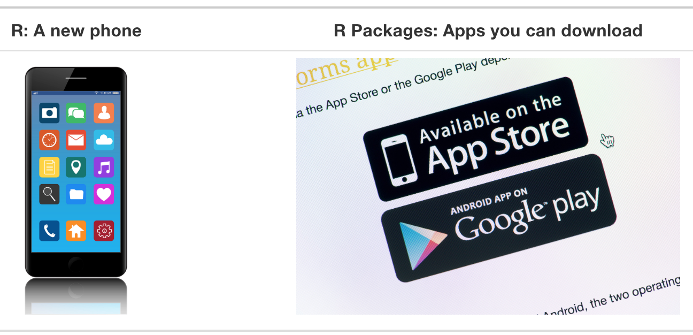
```

R is like a new phone. While it has a certain number of features when you use it for the first time, it doesn't have everything. R packages are like the apps you download onto your phone.

Consider an analogy to Instagram. If you have a new phone and want to share a photo with friends. You need to:

1.  *Install the app*: Since your phone is new and does not include the Instagram app, you need to download the app. You do this only once. (You might need to do this again in the future when there is an update to the app.)
2.  *Open the app*: After you've installed Instagram, you need to open it. You need to do this every time you use the app.

The process is very similar for an R package. You need to:

```{r}
#| fig.cap: Installing versus loading an R package

```

1.  *Install the package*: This is like installing an app on your phone. Most packages are not installed by default when you put R on your computer. Thus if you want to use a package for the first time, you need to install it. Once you've installed a package, you likely won't install it again unless you want to update it to a newer version.

2.  *Load the package*: "Loading" a package is like opening an app on your phone. Packages are not loaded by default when you start Positron. You need to load each package you want to use every time you restart Positron.

Just for this chapter, execute this command in your R Console. Do **not** do this if you are working in the cloud using, for example, Posit Workbench.

```{r}
#| eval: false
#| code-fold: false
options("pkgType" = "binary")
```

This helps to ensure that package installation will go more smoothly. 

Let's *install* a useful package. At the Console within Positron, type:

```{r}
#| eval: false
#| code-fold: false
install.packages("pak")
```

And press `Enter`. You must include the quotation marks around the name of the package. A package can depend on other packages, which will be automatically installed if needed.

One tricky aspect of this process is that R will occasionally ask you:

```{bash}
#| eval: false
#| code-fold: false
Do you want to install from sources the packages which 
need compilation? (Yes/no/cancel)
```

Unless you have a good reason not to, always answer "no" to this question.

**If you are using Windows, there may be a permission problem.** In particular, R may not have permission to install packages in the common area. In that case, it will ask you if you want to create a "Personal" library. You do And then installation should work fine. **But Positron sometimes blocks this message.** In that case, you need quit Positron and start up the R application by itself. In R itself, run `install.packages("pak")`. The message box about creating a personal library should appear. You say "Yes," and all should be well. You can then quit R, restart Positron and continue with the next steps below. 

R packages generally live in one of two places:

-   CRAN (rhymes with "clan") for more mature, popular packages. 

-   Github for more experimental, less stable packages. 

After you install a package, you need to "load" it by using the `library()` command. To load the **pak** package, run the following code in the Console. 

```{r}
#| eval: false
#| code-fold: false
library(pak)
```

After running this code, a blinking cursor should appear next to the `>` symbol. (The `>` is the "prompt.") This means you were successful and the **pak** package is now loaded and ready to use. However, you might get a red "error message" which reads:

<span style="color: red;">Error in library(pak) : there is no package called 'pak'</span>

This error message means that you haven't successfully installed the package. If you get this error message, make sure to install the **pak** package before proceeding. See the above discussion if you are using Windows and you can't seem to install **pak**.

For historical reasons, *packages* are also known as *libraries*, which is why the relevant command for loading them is `library()`.

R will occasionally ask you if you want to install some packages. You almost always want to, otherwise R would not be asking you.

Let's install another package:

```{r}
#| eval: false
#| code-fold: false
pak("tidyverse")
```

We could have used `install.packages()` instead of `pak()` to install the **tidyverse** package, but `pak()` is much faster. 

Instead of loading the **pak** package explicitly with `library(pak)`, we could have just used the "double colon" notation to call the `pak()` function directly: `pak::pak("tidyverse")`. (It is somewhat confusing, although not that uncommon, that `pak()` is the name of the main function in the **pak** package.)

Let's install another package:

```{r}
#| eval: false
#| code-fold: false
pak("PPBDS/tutorial.helpers")
```

This package provides infrastructure for doing tutorials, a common approach for learning R. After you install this package, run this command in the Console:

```{r}
#| eval: false
#| code-fold: false
tutorial.helpers::set_positron_settings()
```

`set_positron_settings()` makes some sensible changes to your Positron settings file and to your `.Rprofile`.

*You have to load each package you want to use every time you start Positron.* If you don't load a package before attempting to use one of its features, you will see an error message like:

<span style="color: red;">Error: could not find function</span>

This is a different error message from the one about a package not having been installed yet. R is telling you that you are trying to use a function in a package that has not yet been loaded. R doesn't know where to "find" the function you want to use.

So far, all the packages we have installed have come from CRAN. To install a package from GitHub, we need to provide both the owner name and the repository (or "repo") name. Copy and paste the following to the Console:

```{r}
#| eval: false
#| code-fold: false
pak("PPBDS/positron.tutorials")
```

The owner here is `PPBDS`, which is the GitHub organization for this *Primer* and its related tutorials. `PPBDS` stands for *Preceptor's Primer for Bayesian Data Science*.

If the install fails, try

```{r}
#| eval: false
#| code-fold: false
options("timeout" = 600)
```

This gives the download more time to complete. Try it again. 

If you do more work with this *Primer*, then you will probably want to install the **primer.tutorials** package, but you don't need to do that now. When you do, run:

```{r}
#| eval: false
#| code-fold: false
pak("PPBDS/primer/primer.tutorials")
```

Some other new packages will be installed as well, most importantly **primer.data**, which includes most of the data we use in the *Primer*. It may take a few minutes. If something gets messed up, it is often useful to read the error messages and see if a specific package is at fault. If so, use the `remove.packages()` function to remove the problematic package and then install it again.

If **primer.tutorials** does not install correctly, don't worry about it for now. This package is much less important than **positron.tutorials**.

### Tutorials {.unnumbered}

There are many tutorials available in the **positron.tutorials** and **primer.tutorials** packages. 

Because Positron is still evolving, there is no easy way to start a tutorial. Instead, we must issue a command like this from the Console:

```{r}
#| eval: false
#| code-fold: false
learnr::run_tutorial(name = "getting-started-with-positron", 
                     package = "tutorial.helpers")
```

The first argument to `run_tutorial()` is the `name` of the tutorial and the second is the `package` in which the tutorial is installed. We often leave out the arguments and just provide their values. Example:

```{r}
#| eval: false
#| code-fold: false
learnr::run_tutorial("getting-started-with-positron", "tutorial.helpers")
```

The Console will show output as the tutorial is starting up because Positron is running the code which creates the tutorial.

In most cases, the newly created tutorial will appear in the Viewer tab. Sometimes, especially on Windows machines, it won't, and your screen will look like this:

```{r}
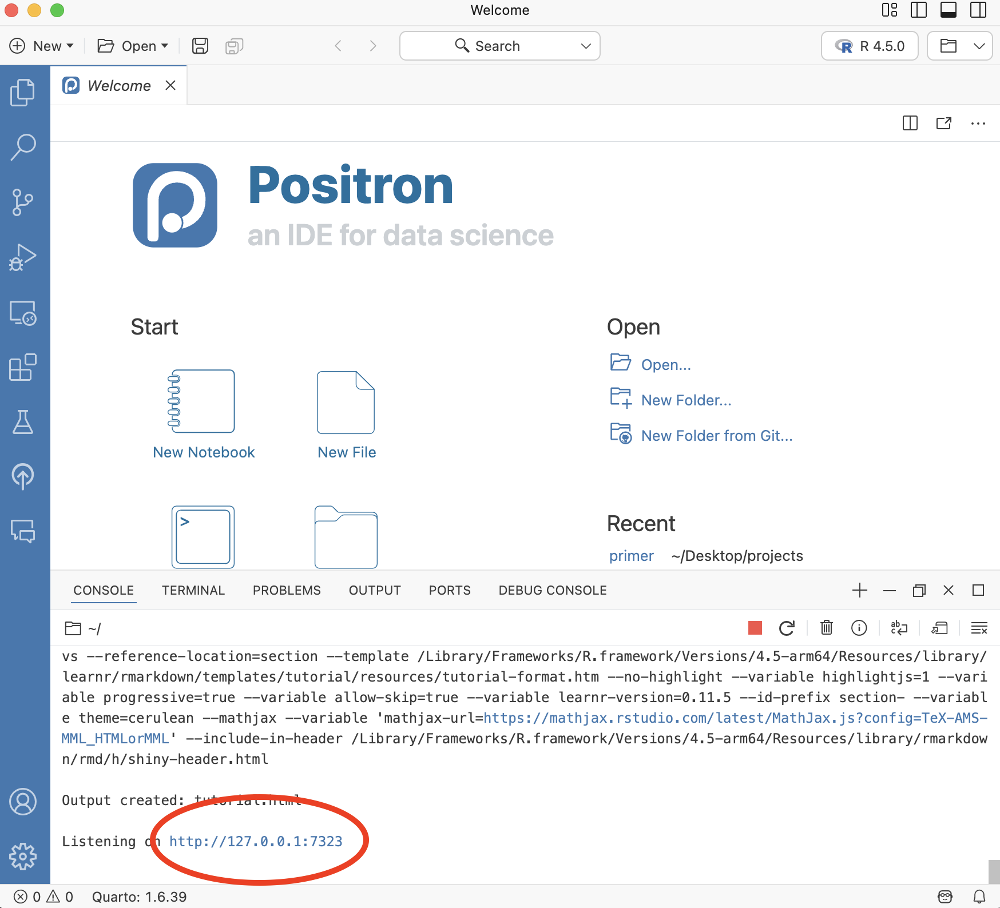
```

Note the URL --- `http://127.0.0.1:7323` --- highlighted in the red oval. This is the location of the newly created tutorial on your machine. The `http://127.0.0.1` portion of the URL, which will be the same for you, indicates the "localhost" for your machine. The `:7323`, which will be different for you, indicates the `tutorial.html` document which has just been created.

Just paste that URL into your browser and start the tutorial.

But, for most people, the tutorial will appear in the Viewer tab: 

```{r}
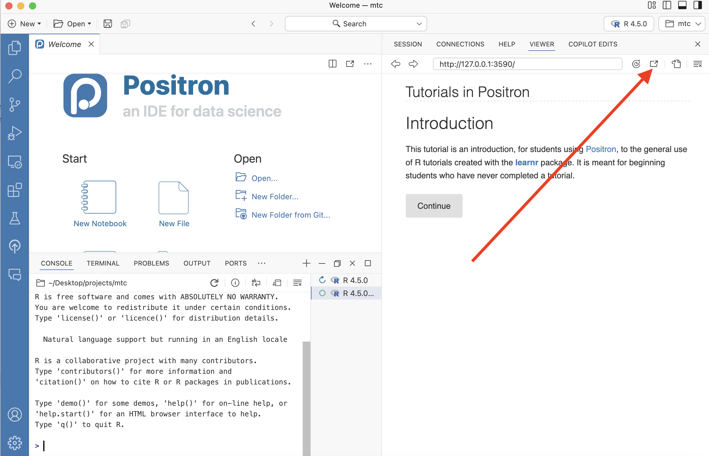
```

You can "pop" the tutorial into a browser by clicking the "Open the current URL in the default browser" button. (See where the red arrow points in the image below.) 

We think that working with the tutorial in the browser is more convenient than using the Viewer tab. If a tutorial becomes "greyed out," you can usually just "refresh" it with the "Reload the current URL" swirly arrow button, just to the left of the "Open the current URL in the default browser" button.

Because the current Console is now being used to run the tutorial, we sometimes need to start up a new session by selecting `File -> New Window`. This creates a new Positron session with an unused R session running in the Console.

You now have two R sessions running. The first is maintaining the tutorial itself, recording your answers. The second allows you to run R commands. You will spend almost all your time with the second session since many tutorials require you to issue some R commands directly to the Console.

**Your work will automatically be saved between Positron sessions**. You can complete the tutorial in multiple sittings.

Complete the "Getting Started" tutorial from the **tutorial.helpers** package. Recall that you start this tutorial by issuing this command in the Console:

```{r}
#| eval: false
#| code-fold: false
learnr::run_tutorial(name = "getting-started-with-positron", 
                     package = "tutorial.helpers")
```

Once you have done so, you can start to learn about data science.

### Summary for local {.unnumbered}

You should have done the following:

  - Installed the latest versions of [R](https://cloud.r-project.org/) and [Positron](https://github.com/posit-dev/positron/releases).

  - If using Windows, installed [Git for Windows](https://gitforwindows.org/) and [RTools](https://cran.r-project.org/bin/windows/Rtools/).
  
  - Installed, from CRAN, these packages:

```{r}
#| eval: false
#| code-fold: false
# Only run this options() line if NOT on Cloud platform
# options("pkgType" = "binary"). 
install.packages("pak")
pak::pak("tidyverse")
```

  - Installed, from Github, these packages:

```{r}
#| eval: false
#| code-fold: false
pak::pak(c("PPBDS/tutorial.helpers", "PPBDS/positron.tutorials"))
```

  - Run `tutorial.helpers::set_positron_settings()` at the Console in order to make some sensible changes to your Positron and Rprofile settings.

```{r}
#| eval: false
#| code-fold: false
tutorial.helpers::set_positron_settings()
```

  - Completed the "Getting Started with Positron" tutorial from the **tutorial.helpers** package:
  
```{r}
#| eval: false
#| code-fold: false
learnr::run_tutorial("getting-started-with-positron", package = "tutorial.helpers")
```

Let's get started!

```{r}

```

