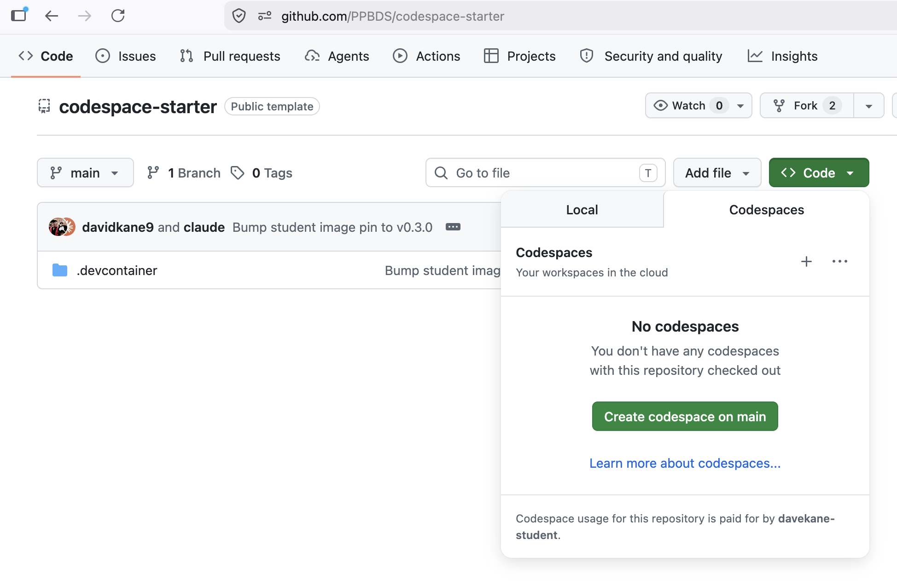
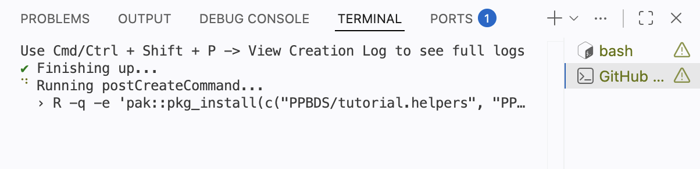
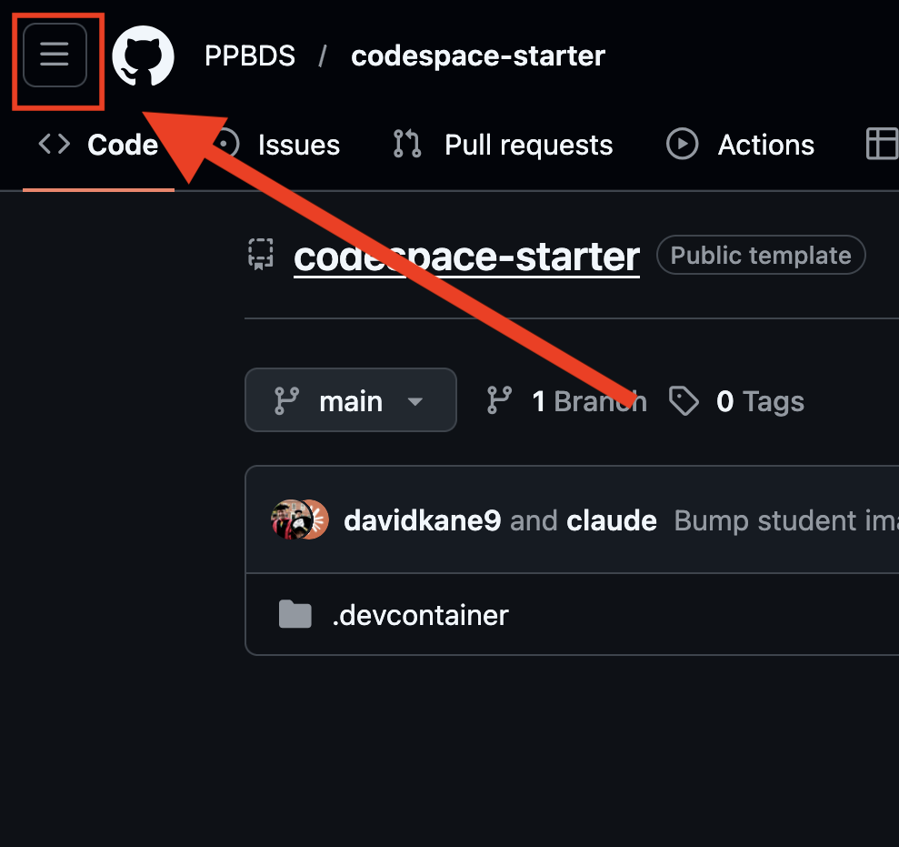
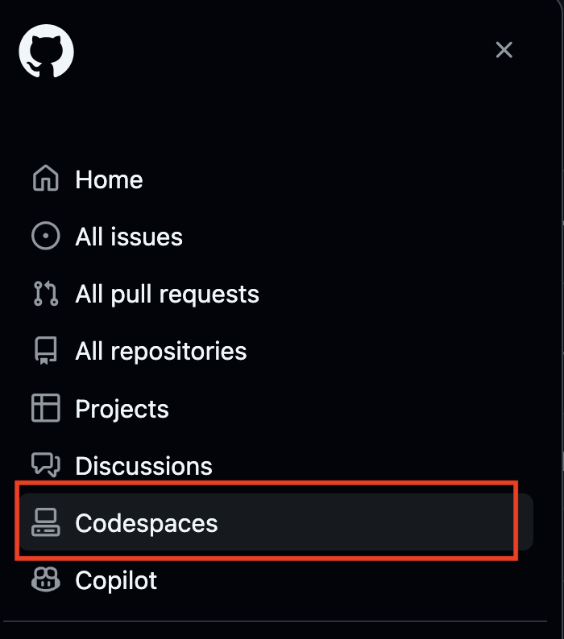
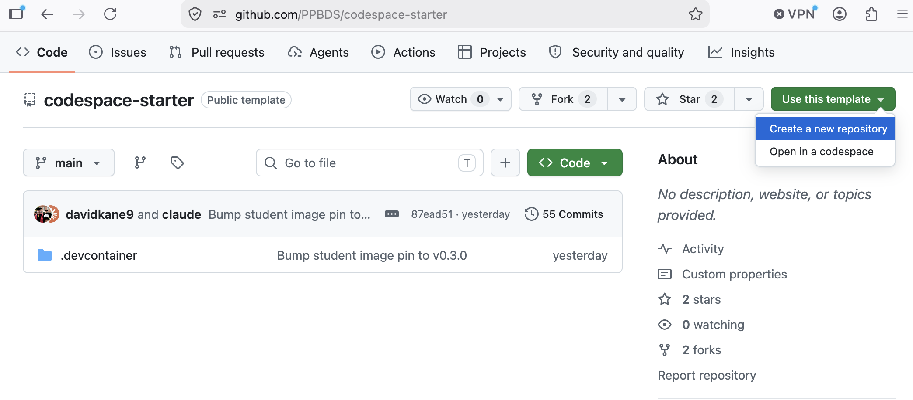
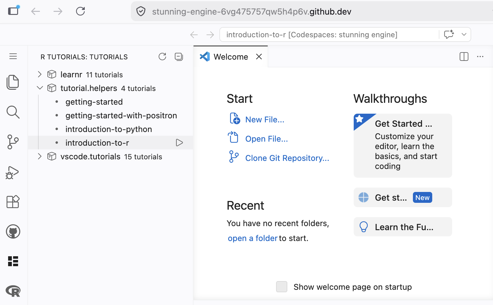

# Getting Started {.unnumbered}

*You can never look at the data too much.* -- Mark Engerman

The world confronts us. Make decisions we must.

We do all of our data science in the cloud, using GitHub Codespaces with Visual Studio Code (VS Code). This chapter walks you through your first tutorials and the workflow you'll use throughout the book.

There are three ways to work, and you will meet all three:

- **Start** --- Launch a Codespace directly on `PPBDS/codespace-starter`, a public repository you do *not* own. It is fast (the image is pre-built) and needs no setup. Nothing you do *in the Codespace* persists once you delete it, but you can still complete tutorials and download your answers. **The first several tutorials --- including "Introduction to R" --- work entirely this way: no repository required.**
- **Launch** *(recommended)* --- Launch that same fast `codespace-starter` Codespace, then run one command (`make_repo.sh`) that creates a repository you *own* and sets you up to work in it. You get the quick startup *and* a permanent home for your work. You will need this for later tutorials whose work you want to keep and build on.
- **Template** --- Use GitHub's "Use this template" button to copy `codespace-starter` into a repository you own, then launch a Codespace on that copy. It does the same job as Launch, but the first launch is **slow** (several minutes) because your copy has no pre-built image. We document it as a fallback; prefer **Launch**.

For the **first four or five tutorials** you just use **Start** mode and download your answers --- there is nothing to set up and no repository to manage. Later tutorials ask you to save your work in a repository you own; for those you will use **Launch** (recommended) or **Template**. When you do create a repository, the naming rule is simple: the repository name is the tutorial id (the tutorial title in lowercase, with spaces replaced by dashes) --- so "Probability" becomes `probability`, and so on.

In this chapter you will use **Start** mode to run both the "Getting Started" and "Introduction to R" tutorials. Then, so you are ready when you need it, we walk through **Launch** (and **Template**) for creating your own repository later.

## GitHub {.unnumbered}

Sign up for a GitHub account by following the instructions on the [GitHub homepage](https://github.com/). **Follow [this advice](https://happygitwithr.com/github-acct.html#username-advice) when choosing your username.**

Use a permanent email address for this account — not one tied to your current school or job, which you'll lose access to when you move on. Your GitHub account is for life. Your school email is not. However, if you are a student or teacher, you will want to [assign your school email](https://github.com/settings/emails) as a second email to your account so that you can qualify for the [GitHub Student Developer Pack](https://education.github.com/pack) (free Copilot, extra Codespaces hours, and 100+ other perks). If your school doesn't issue email addresses, you can also apply by uploading a student ID or enrollment letter.

On GitHub, your projects are organized into "repositories," usually called "repos."

GitHub gives every account 60 free Codespaces hours per month, and more if you join [GitHub Education](https://github.com/education), an option that we highly recommend for students. It also provides lots of free storage. Free hours are not infinite, however, so it is your responsibility to stop (and delete) Codespaces you are not using.

## Start mode: a throwaway Codespace {.unnumbered}

In **Start mode** you work inside a `codespace-starter` Codespace that you do not own. It is the fastest way to get going and perfect for trying things out or running a tutorial, but nothing you do persists once you delete the Codespace. We use it here to learn the platform and run the "Getting Started" tutorial.

Go to [`https://github.com/PPBDS/codespace-starter`](https://github.com/PPBDS/codespace-starter).

```{r}
knitr::include_graphics("getting-started/images/cs-1.png")
```

This is a public repository you do not own. You can still launch a Codespace from it, but nothing you do persists once the Codespace is deleted. That is intentional. This Codespace is for learning the platform, not for your permanent work.

### Launching the Codespace {.unnumbered}

Click the green **Code** button at the top right of the repository page, switch to the **Codespaces** tab, and click **"Create codespace on main."**

```{r}

```

This will take a minute or so. Behind the scenes, GitHub is creating a virtual machine in the cloud with all the necessary tools for doing data science. That machine is called a "Codespace."

You can tell that the Codespace is not ready by noticing the "Setting up remote connection: Building Codespace..." message in the lower right. GitHub is creating the Codespace following the instructions in the `devcontainer.json` file located in the `.devcontainer` directory.

```{r}
knitr::include_graphics("getting-started/images/cs-2d.png")
```

When that message disappears, the Codespace is built. You still need to connect to it, as indicated by the "Opening remote" message in the lower left.

```{r}
knitr::include_graphics("getting-started/images/cs-2e.png")
```

Once that disappears, you are connected, but the Codespace usually still has a few things to install. You can tell that it is not finished by looking in the upper left.

```{r}
knitr::include_graphics("getting-started/images/cs-2f.png")
```

Note the blue dash moving above the repo name. That indicates the process is not complete. Only the five default "extensions" appear along the left edge. Our `devcontainer.json` file installs several more at the end. The last step in the process is the installation of the R packages we use for tutorials. You can see that occurring here:


```{r}

```


The Codespace should now be displaying its GitHub-assigned name. The process is complete when your Codespace looks like this:

```{r}
knitr::include_graphics("getting-started/images/cs-3.png")
```

The blue dash has disappeared. Several more extensions have been installed. The GitHub name, `fictional winner`, now appears next to the repo name as well as in the quick access window above the editor. Your name will be different, as GitHub assigns a unique name to each Codespace.

### Touring the workspace {.unnumbered}

VS Code is an integrated development environment (IDE) for coding and data science. Highlights:

* This Codespace is in the cloud. The URL will be a combination of the GitHub-determined human-readable but somewhat nonsensical name — `fictional winner` in this case — and a bunch of letters and numbers. There is no need to remember this URL. GitHub keeps track of things. You can see all your current Codespaces at [`https://github.com/codespacesr`](https://github.com/codespaces).

* In the upper right-hand corner are the "Customize Layout ..." buttons. These are part of the VS Code "Title Bar." Since we aren't using the AI tools right now, it often makes sense to close the "Chat" window, which appears on the right side of the screen. You can close this in two ways: Click the "X" mark or click the "Toggle Secondary Side Bar" button, the furthest right-hand button. You can then bring the Chat window back by clicking the "Toggle Secondary Side Bar" button again. Try it now.

```{r}
knitr::include_graphics("getting-started/images/chat-buttons-cs.png")
```

* The "Activity Bar" is the narrow vertical strip on the far left with icons for Explorer, Search, Source Control, Extensions, etc. By default, the "Explorer" button is selected, showing that the only thing in the project is a (hidden) folder called `.devcontainer`. Click on that folder to show its contents.

```{r}
knitr::include_graphics("getting-started/images/cs-4.png")
```

Click on the `devcontainer.json` file. Doing so opens that file in the Editor window. Your screen should now look like this:

```{r}
knitr::include_graphics("getting-started/images/cs-4b.png")
```

* The "Editor" is the large central area where you edit files.

* The "Panel" is the horizontal area below the Editor, containing the Problems, Output, Debug Console, Terminal, and Ports tabs. Our main focus is the Terminal tab. This is where we "talk" to both the (cloud) computer itself and to the R program that it provides.

* The Terminal currently shows a "bash" shell. We will learn more about shells later. Click on the `+` sign to the right of the "Ports" tab. This will start a second bash shell. Your Panel should now look like this:

```{r}
knitr::include_graphics("getting-started/images/cs-5.png")
```

* Note the two bash shells on the right side of the Panel. We can click on each to move back and forth between them.

* In addition to shells, we can also start an R session under the Terminal. Instead of clicking the `+` sign, click the small downward pointing arrow next to it. This will show a variety of options.

```{r}
knitr::include_graphics("getting-started/images/cs-6.png")
```

* Select "R Terminal." This will start an R session that lets you "talk" to R in the same way that a bash shell allows you to talk to the computer.

* Click on the "R Interactive" option which should appear beneath the two bash lines on the right side of the Panel.

* Type in `2 + 2` at the R prompt and hit `enter` (Windows) or `return` (Mac). (Going forward we will just use `Enter` to refer to this action. Mac users should hit `return`.)

* Type in `plot(1:10)` at the R prompt. Hit `Enter`. Your screen should look like:

```{r}
knitr::include_graphics("getting-started/images/cs-7.png")
```

An IDE like VS Code is designed to organize all the different work we do as data scientists. We need to talk to the computer via the shell, talk to R, view plots, and so on.

### Running the Getting Started tutorial {.unnumbered}

If you hover your cursor over the Activity Bar on the far lefthand side, you can see the names of the different options. The second from the bottom is labeled "R Tutorials." Click on it. (You might need to click twice.) This brings up all the R packages with tutorials. Click on the package name **[tutorial.helpers](https://ppbds.github.io/tutorial.helpers/)**.

```{r}
knitr::include_graphics("getting-started/images/cs-8.png")
```

Doing so shows all the R tutorials which are in the **[tutorial.helpers](https://ppbds.github.io/tutorial.helpers/)** package. If you hover your cursor over a tutorial, a rightward pointing arrow appears. Clicking that arrow starts the tutorial. Start the `getting-started` tutorial from the **[tutorial.helpers](https://ppbds.github.io/tutorial.helpers/)** package. Do so now.

```{r}
knitr::include_graphics("getting-started/images/cs-9.png")
```

Clicking the tutorial arrow starts a new R session, labeled "R Tutorial" on the right side of the panel. We now have four different terminals: two bash and two R. In this case, a "terminal" is any connection to the (cloud) computer itself or to a program running on it, like R. In fact, the [bash shell](https://opensource.com/resources/what-bash) is just another program which runs in the computer.

The R Tutorial session shows the tutorial being built and its current state, which is "listening," i.e., waiting for you to complete the tutorial. While the tutorial is running, this R session is unavailable for other work.

You should also have been given an option to open the tutorial in the browser. You should take that option. If it does not appear, or if you missed it, you can also open the tutorial by hand:

```{r}
knitr::include_graphics("getting-started/images/cs-10.png")
```

The `http` address refers to a file located in your GitHub Codespace but which is still visible on your local machine via the magic of "port forwarding," meaning that the Codespace is allowing your browser to open it. Opening it in your browser shows:

```{r}
knitr::include_graphics("getting-started/images/cs-11.png")
```

Read and follow the instructions. At the end of the tutorial, download your answers.

### Running the Introduction to R tutorial {.unnumbered}

The first several tutorials all work this same way, so let's do one more right here in the same throwaway Codespace. Open the **R Tutorials** panel again, click **[tutorial.helpers](https://ppbds.github.io/tutorial.helpers/)**, and start the **Introduction to R** tutorial. Read and follow the instructions, and download your answers at the end --- just as you did for "Getting Started."

You can run any of the first several tutorials this way in a Start-mode Codespace. Because there is no repository, the *only* thing you keep is the answers file you download, so be sure to download it before you delete the Codespace.

### Stopping, restarting and deleting the Codespace {.unnumbered}

A Codespace is your responsibility in the same way that your laptop is your responsibility. While a Codespace is running it counts against your free hours, and an unused Codespace will be deleted by GitHub after 30 days.

There are three common ways to close a Codespace.

First, just leave it alone. GitHub will close it on its own after 30 minutes of inactivity, though we recommend changing that default to 15 minutes in your [Codespaces settings](https://github.com/settings/codespaces).

Second, type `Cmd + Shift + P` (on Mac) or `Ctrl + Shift + P` (on Windows/Linux) to bring up the Command Palette. (Throughout this book, shortcuts are written like `Cmd/Ctrl + Shift + P`, meaning the `command` key on Mac or the `control` key on Windows/Linux.) The Command Palette provides access to all VS Code commands. Type `stop` into the search bar.

On some browsers, the keyboard shortcut does not work. You can always access the Command Palette by clicking the search bar at the top of the window and typing `>` followed by the command you would like to use.

```{r}
knitr::include_graphics("getting-started/images/command-palette.png")
```

Select "Codespaces: Stop Current Codespace." You will see a progress bar in the lower right.

Third, you can go to your main Codespaces control panel at [`https://github.com/codespaces`](https://github.com/codespaces). You can also reach this page from any page on GitHub by clicking the menu icon in the upper left and selecting "Codespaces":

```{r}


```

Either path brings you here:

```{r}
knitr::include_graphics("getting-started/images/codespaces-1.png")
```

This shows all your Codespaces, both active and inactive. The `...` menu on each row provides several commands, including "Stop Codespace."

```{r}
knitr::include_graphics("getting-started/images/codespaces-2.png")
```

Simply closing the browser window *does not* stop your Codespace from running. Always stop a Codespace explicitly to preserve your free hours.

Now stop this Codespace using whichever method you prefer.

Once it is stopped, you can restart it from your [Codespaces page](https://github.com/codespaces) by clicking the `...` menu next to this Codespace and then selecting **Open in Browser**.

```{r}
knitr::include_graphics("getting-started/images/codespaces-3.png")
```

Once you are done with a Codespace, you should **delete it.** To do so, go to your [Codespaces page](https://github.com/codespaces), click the `...` menu next to this Codespace and select **Delete**.

This Codespace was a sandbox. You do not own `PPBDS/codespace-starter`, so there is nowhere for your work to go once you stop using the Codespace. That is fine — you have already downloaded your tutorial answers, which is the only thing here worth keeping.

## Launch mode: your own repo, the fast way {.unnumbered}

**This is the recommended method for tutorials that need their own repository.** You launch the same fast, pre-built `codespace-starter` Codespace you used in Start mode, then run a single command that creates a repository you *own* and sets you up to work in it --- so you get the quick startup *and* a permanent home for your work.

You will not need this for a while: the first several tutorials run entirely in Start mode. But when a tutorial asks you to keep your work in your own repository, this is how. The walkthrough below uses `my-tutorial` as a stand-in --- put the id of whatever tutorial you are on in its place.

### Launching the Codespace {.unnumbered}

Exactly as in Start mode: from [`https://github.com/PPBDS/codespace-starter`](https://github.com/PPBDS/codespace-starter), click the green **Code** button, switch to the **Codespaces** tab, and click **"Create codespace on main."**

When the Codespace finishes loading, the terminal greets you with a banner:

```
════════════════════════════════════════════════════════════
   ✅  YOUR CODESPACE IS READY

   Start your own project (creates a new repo):
       bash /workspaces/codespace-starter/.devcontainer/make_repo.sh <repo-name>

   Full guide: /workspaces/codespace-starter/.devcontainer/STUDENT_WORKFLOW.md

   Type `clear` to remove this banner.
════════════════════════════════════════════════════════════
```

That banner is also your "ready" signal: when it appears, every extension and R package is installed and the Codespace is fully set up. (If you want it gone, type `clear`, as it suggests.)

### Creating your repository {.unnumbered}

In the terminal, run the command the banner shows, using the tutorial id as the repository name:

```
bash .devcontainer/make_repo.sh my-tutorial
```

The **first time** you run this in a Codespace, you are asked to sign in to GitHub: a one-time code appears and a browser tab opens --- paste the code and click **Authorize**. This signs you in as *yourself*, which is what lets the Codespace create and save to your own repositories. (Out of the box, a Codespace launched on `codespace-starter` can only touch `codespace-starter`.) You do this **once per Codespace**.

When it finishes, a second banner confirms what happened:

```
════════════════════════════════════════════════════════════
   🎉  Created your repo: my-tutorial   (/workspaces/my-tutorial)

   👉 Open it:  File → Open Folder → /workspaces/my-tutorial
      (the editor may switch on its own; if not, use that menu)

   Then, working inside your repo:
   • Save your work:    commit + push  (Source Control panel, left)
   • Publish a graphic: see .devcontainer/STUDENT_WORKFLOW.md
════════════════════════════════════════════════════════════
```

Your repository now exists at `https://github.com/<your-username>/my-tutorial`, and a copy has been downloaded into the Codespace at `/workspaces/my-tutorial`.

### Opening your repository {.unnumbered}

Do the one manual step the banner points to: **File → Open Folder → `/workspaces/my-tutorial`**, and confirm in the dialog. (A Codespace will not reliably switch folders from a script, so you do this by hand.) The window reloads into your repository.

After the reload, the banner changes to show where you are:

```
════════════════════════════════════════════════════════════
   📂  Your repo: my-tutorial

   • Explorer shows my-tutorial?  You're in it — commit & push via
     the Source Control panel (left).
   • If not:  File → Open Folder → /workspaces/my-tutorial

   Guide: /workspaces/codespace-starter/.devcontainer/STUDENT_WORKFLOW.md
   Type `clear` to remove this banner.
════════════════════════════════════════════════════════════
```

Look at the **Explorer** in the upper left --- it should now read `MY-TUTORIAL`. You are working inside your own repository, and anything you commit and push from the **Source Control** panel is saved there permanently.

### Running the tutorial {.unnumbered}

Click the **R Tutorials** icon on the Activity Bar, click **[tutorial.helpers](https://ppbds.github.io/tutorial.helpers/)**, and start your tutorial --- the same way you started "Getting Started" in Start mode. Read and follow the instructions, and download your answers at the end.

Because this repository is *yours*, you can also save your work to GitHub: open the **Source Control** panel on the left, type a short message, and click **✓ Commit**, then **Sync Changes** (or **Publish Branch** the first time).

### Stopping the Codespace {.unnumbered}

When you are done, **stop** the Codespace (Command Palette → "Codespaces: Stop Current Codespace," or from your [Codespaces page](https://github.com/codespaces)). Your work is safe in your `my-tutorial` repository, so it is fine to reopen this Codespace later or to delete it --- deleting discards only the Codespace, never your pushed work. (As always, anything you have *not* committed and pushed is lost when a Codespace is deleted.)

## Template mode: your own repo, the slow way {.unnumbered}

**Launch mode (above) is the recommended way to create a tutorial repository.** Like Launch, this is only for the later tutorials that need their own repository. It produces the *same* kind of owned repository, but its first launch is **much slower**, so use it only as a fallback --- for a given tutorial you use Launch *or* Template, not both.

It works by copying `codespace-starter` into a repository you own. (The screenshots below were captured with an example repo name; use your tutorial's id.)

### Creating the repository from the template {.unnumbered}

Go back to [`https://github.com/PPBDS/codespace-starter`](https://github.com/PPBDS/codespace-starter). Click the green **"Use this template"** button at the top right and select **"Create a new repository."**

```{r}

```

In the **Repository name** field, type the tutorial id (its title in lowercase, spaces replaced by dashes --- the same naming rule as Launch mode). Leave everything else at the defaults, then click **Create repository from template.**


```{r}
knitr::include_graphics("getting-started/images/new-3.png")
```

You now own a repository at `https://github.com/<your-username>/<tutorial-id>`. It is identical to `PPBDS/codespace-starter` but yours --- anything you do here can be saved permanently, unlike in a Start-mode Codespace.

### Launching a Codespace on your repo {.unnumbered}

From your new repository's page, click the green **Code** button, switch to the **Codespaces** tab, and click **"Create codespace on main."**

```{r}
knitr::include_graphics("getting-started/images/new-4.png")
```

This Codespace takes **several minutes longer** to launch than a Start- or Launch-mode one. The reason: `PPBDS/codespace-starter` has a pre-built container image, but your template copy does not, so the container builds from scratch the first time. (That slow build is exactly why we recommend Launch.) Subsequent launches of this *same* Codespace are fast.

### Running the tutorial {.unnumbered}

Once the Codespace is fully loaded, click the **R Tutorials** icon on the Activity Bar, click on **[tutorial.helpers](https://ppbds.github.io/tutorial.helpers/)**, and start your tutorial.

```{r}

```

Read and follow the instructions. At the end, download your answers, and commit + push your work from the **Source Control** panel.

### Stopping the Codespace {.unnumbered}

When you are done, **stop** the Codespace --- via the Command Palette or your [Codespaces page](https://github.com/codespaces). Because your work lives in your own repository, your committed-and-pushed work is safe whether you stop, reopen, or delete the Codespace. (Anything you have *not* committed and pushed is lost on delete.)

## Using your own machine

You can do all of this work on your own laptop, if you prefer. But, in that case, you are responsible for setting everything up. That means installing VS Code, Git and R. You will almost certainly want to install the same VS Code extensions which we use:

```
"extensions": [
  "reditorsupport.r",
  "quarto.quarto",
  "PPBDS.vscode-r-tutorials",
  "ritwickdey.LiveServer",
  "tomoki1207.pdf",
  "mechatroner.rainbow-csv"
],
```

This listing is from  the `.devcontainer/devcontainer.json` file from `PPBDS/codespace-starter`. You may also find it useful to use the same VS settings which are defined there. 

You will also need to install, by hand, various R packages. From the R Terminal, you would run commands like:

```
install.packages("pak") 
```

You may be asked to select a CRAN mirror. It does not matter which you choose.

```
pak::pak("tidyverse")  
pak::pak("PPBDS/vscode.tutorials")  
```

These steps are not enough to perfectly replicate what we show in the Codespace. See `PPBDS/devcontainers` for more details.

But this should be enough to get you started, should you decide to go this route. If you have trouble, ask AI, pointing it toward this chapter and to the `PPBDS/codespace-starter` and `PPBDS/devcontainers` repos.

## Summary {.unnumbered}

You should have done the following:

- Signed up for a GitHub account.
- Used **Start** mode --- a throwaway Codespace on `PPBDS/codespace-starter` --- to complete the **Getting Started** and **Introduction to R** tutorials from **[tutorial.helpers](https://ppbds.github.io/tutorial.helpers/)**, downloaded your answers, then **deleted** the Codespace.
- Seen how **Launch** (recommended) and **Template** (slower fallback) create a repository you *own*, for the later tutorials that need one.

For the first several tutorials you just use **Start** mode and download your answers --- no repository needed. When a later tutorial does need its own repository, use **Launch** (or **Template**), naming it with the tutorial id (the title in lowercase, with spaces replaced by dashes).

Let's get started!

```{r}
knitr::include_graphics("getting-started/images/ending.gif")
```

