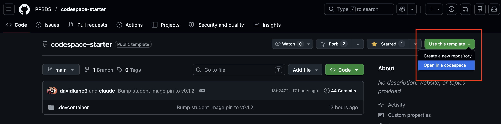

# Getting Started {.unnumbered}

*You can never look at the data too much.* -- Mark Engerman

The world confronts us. Make decisions we must.

We do all of our data science in the cloud, using GitHub Codespaces with Visual Studio Code (VS Code). Working in the cloud means we can set up a complete data science environment for you, rather than asking you to configure your own computer. This chapter introduces GitHub, Codespaces, and VS Code, and walks you through your first tutorial.

## GitHub  {.unnumbered}

Sign up for a GitHub account by following the instructions on the [GitHub homepage](https://github.com/). **Follow [this advice](https://happygitwithr.com/github-acct.html#username-advice) when choosing your username.**

Use a permanent email address for this account — not one tied to your current school or job, which you'll lose access to when you move on. Your GitHub account is for life; your school email isn't. However, if you are a student or teacher, you will want to [assign your school email](https://github.com/settings/emails) as a second email to your account so that you can qualify for the [GitHub Student Developer Pack](https://education.github.com/pack) (free Copilot, extra Codespaces hours, and 100+ other perks). If your school doesn't issue email addresses, you can also apply by uploading a student ID or enrollment letter.

On GitHub, your projects are organized into "repositories," usually called "repos."

## Starting a Codespace  {.unnumbered}

Instead of working on your computer, you will work in a [GitHub Codespace](https://github.com/features/codespaces). This is a cloud-based [virtual machine](https://en.wikipedia.org/wiki/Virtual_machine) that we can set up for data science much more easily than configuring your own computer.

Once you are logged in to your GitHub account, go to [this URL](https://github.com/PPBDS/codespace-starter) in your browser:

`https://github.com/PPBDS/codespace-starter`

```{r}
knitr::include_graphics("getting-started/images/cs-1.png")
```

You can also create your own Codespace from scratch. However, because this setup is new, we have created the basic setup files, mainly `devcontainer.json`, in a sensible fashion in this GitHub repository. In particular, we ensure that R is installed along with some important packages and useful extensions for VS Code.

<!-- TODO: Distribution model / prebuild. "Use this template" creates a fresh
copy repo, which does NOT inherit the Codespaces prebuild configured on
PPBDS/codespace-starter — so the student's first launch is a slow cold
build. Decide whether students should (a) launch a Codespace directly
from codespace-starter (gets the prebuild) or (b) work in a template
copy (no prebuild). See the TODO in codespace-starter's devcontainer.json.
Update the instruction below once that's settled. -->

Click the green "Use this template" button in the upper right. Select the "Open in a Codespace" option.

```{r}

```


This will take a few minutes to run. Read the rest of this chapter while you are waiting. Behind the scenes, GitHub is creating a virtual machine in the cloud with all the necessary tools for doing data science. That machine is called a "Codespace."

You can tell that the Codespace is not ready by noticing the "Setting up remote connection: Building Codespace..." message in the lower right. GitHub is creating a Codespace following the instructions in the `devcontainer.json` file located in the `.devcontainer` directory.

```{r}
knitr::include_graphics("getting-started/images/cs-2d.png")
```

When that message disappears, it means that your Codespace is built. But you still need to connect to it, as indicated by the "Opening remote" message in the lower left.

```{r}
knitr::include_graphics("getting-started/images/cs-2e.png")
```

Once that disappears, you are connected to your Codespace, but it usually still has a few things to install. You can tell that it is not finished by looking in the upper left.

```{r}
knitr::include_graphics("getting-started/images/cs-2f.png")
```

First, note the blue dash moving above the repo name. That indicates that the process is not complete. Second, only the five default "extensions" appear along the left edge. Our `devcontainer.json` file installs several more at the end. Third, the Codespace is not displaying its GitHub-assigned name. The process is complete when your Codespace looks like this:

```{r}
knitr::include_graphics("getting-started/images/cs-3.png")
```

The blue dash has disappeared. Several more extensions have been installed. The GitHub name, `fictional winner`, now appears next to the repo name as well as in the quick access window above the editor. Your name will be different, as GitHub assigns a unique name to each Codespace.


## Stopping a Codespace  {.unnumbered}

GitHub allows 60 hours of free Codespaces usage each month, and probably more if you join [GitHub Education](https://github.com/education), an option that we highly recommend for students. It also provides lots of free storage. However, if you want to avoid paying, you need to be aware of your usage.

A Codespace is your responsibility in the same way that your laptop is your responsibility. An unused Codespace will be deleted after 30 days.

There are three common ways to close Codespaces.

First, just leave the Codespace alone, and it will close on its own. GitHub monitors Codespaces. By default, it will close your Codespace if it is not used for 30 minutes, although I recommend changing that default to 15 minutes.

Second, type `Cmd + Shift + P` (on Mac) or `Ctrl + Shift + P` (on Windows/Linux) to bring up the Command Palette. (Throughout this book, shortcuts are written like `Cmd/Ctrl + Shift + P`, meaning the `command` key on Mac or the `control` key on Windows/Linux.) The Command Palette provides access to all VS Code commands. Type `stop` into the search bar.

On some browsers, the keyboard shortcut does not work. You can always access the Command Palette by clicking the search bar at the top of the window and typing `>` followed by the command you would like to use.


```{r}
knitr::include_graphics("getting-started/images/command-palette.png")
```


Select "Codespaces: Stop Current Codespace." Note how search in the Command Palette works. As long as you remember at least one word in the command you are looking for, it will find that command. Searching for general topics, like "Codespace," also works well.

Once you run the command, you will see a progress bar in the lower right.

Third, you can go to your main Codespaces control panel at `https://github.com/codespaces`.

```{r}
knitr::include_graphics("getting-started/images/codespaces-1.png")
```

This will show all your Codespaces, both active and inactive. The `...` menu in the lower right provides several common commands. The most relevant one for us now is "Stop Codespace." Selecting that button is the third way to stop a Codespace.

<!-- Could add some red arrows to the Active and Last active information in the lower left, along with discussion. -->

```{r}
knitr::include_graphics("getting-started/images/codespaces-2.png")
```

You can restart a Codespace from the same location. The set of commands brought up by clicking `...` is slightly different now. Selecting "Open in browser" restarts the Codespace.

You can also restart a Codespace by clicking on the title of a Codespace. This will open a new tab with your Codespace.

```{r}
knitr::include_graphics("getting-started/images/codespaces-3.png")
```

Simply closing the browser window *does not* stop your Codespace from running. Make sure to always stop running your Codespace to preserve your Codespace time.

## Using a Codespace  {.unnumbered}

Visual Studio Code, also known as "VS Code," is an integrated development environment (IDE) for coding and data science. Highlights:

* This Codespace is in the cloud. The URL will be a combination of the GitHub-determined human-readable but somewhat nonsensical name--`fictional winner` in this case--and a bunch of letters and numbers. There is no need to remember this URL. GitHub keeps track of things. You can see all your current Codespaces [here](https://github.com/codespaces).

* In the upper right-hand corner are the "Customize Layout ..." buttons. These are part of the VS Code "Title Bar." Since we aren't using the AI tools right now, it often makes sense to close the "Chat" window, which appears on the right side of the screen. You can close this in two ways: Click the "X" mark or click the "Toggle Secondary Side Bar" button, the furthest right-hand button. You can then bring the Chat window back by clicking the "Toggle Secondary Side Bar" button again. Try it now.

```{r}
knitr::include_graphics("getting-started/images/chat-buttons-cs.png")
```

* The "Activity Bar" is the narrow vertical strip on the far left with icons for Explorer, Search, Source Control, Extensions, etc.  By default, the "Explorer" button is selected, showing that the only thing in the project is a (hidden) folder called `.devcontainer`. Click on that folder to show its contents.

<!-- DK: Could put in a bunch more images . . . -->

```{r}
knitr::include_graphics("getting-started/images/cs-4.png")
```

Click on the `devcontainer.json` file. Doing so opens that file in the Editor window. Your screen should now look like this:

```{r}
knitr::include_graphics("getting-started/images/cs-4b.png")
```


* The "Editor" is the large central area where you edit files.

* The "Panel" is the horizontal area below the Editor, containing the Terminal, Output, Problems, Debug Console, and Ports tabs. Our main focus is the Terminal tab. This is where we "talk" to both the (cloud) computer itself and to the R program that it provides.

* The Terminal currently shows a "bash" shell. We will learn more about shells later. Click on the `+` sign to the right of the "Ports" tab. This will start a second bash shell. Your Panel should now look like this:

```{r}
knitr::include_graphics("getting-started/images/cs-5.png")
```

<!-- DK: Maybe close the Codespace and open it again?

AR: Added to end of the Starting a Codespace section (where we initially tell students how to close a Codespace, but didn't tell them how to re-open. -->

* Note the two bash shells on the right side of the Panel. We can click on each to move back and forth between them.

* In addition to shells, we can also start an R session under the Terminal. Instead of clicking the `+` sign, click the small downward pointing arrow next to it. This will show a variety of options.

```{r}
knitr::include_graphics("getting-started/images/cs-6.png")
```

* Select "R Terminal." This will start an R session that lets you "talk" to R in the same way that a bash shell allows you to talk to the computer.

* Click on the "R Interactive" option which should appear beneath the two bash lines on the right side of the Panel.

* Type in `2 + 2` at the R prompt and hit `enter` (Windows) or `return` (Mac). (Going forward we will just use `enter` to refer to this action. Mac users should hit `return`.)

* Type in `plot(1:10)` at the R prompt. Hit `enter`. Your screen should look like:

```{r}
knitr::include_graphics("getting-started/images/cs-7.png")
```

An IDE like VS Code is designed to organize all the different work we do as data scientists. We need to talk to the computer via the shell, talk to R, view plots, and so on.

## Tutorials {.unnumbered}

<!-- DK: This section could use a few more screens, more slowly. But even better would be a video! -->

If you hover your cursor over the Activity Bar on the far lefthand side, you can see the names of the different options. The second from the bottom is labeled "R Tutorials." Click on it. (You might need to click twice.) This brings up all the R packages with tutorials. Click on the package name `tutorial.helpers`.

```{r}
knitr::include_graphics("getting-started/images/cs-8.png")
```

Doing so shows all the R tutorials which are in the `tutorial.helpers` package. If you hover your cursor over a tutorial, a rightward pointing arrow appears. Clicking that arrow starts the tutorial. Start the `getting-started` tutorial from the **tutorial.helpers** package. Do so now.

```{r}
knitr::include_graphics("getting-started/images/cs-9.png")
```

Clicking the tutorial arrow starts a new R session, labeled "R Tutorial" on the right side of the panel. We now have 4 different terminals: two bash and two R. In this case, a "terminal" is any connection to the (cloud) computer itself or to a program running on it, like R. In fact, the [bash shell](https://opensource.com/resources/what-bash) is just another program which runs in the computer.

The R Tutorial session shows the tutorial being built and its current state, which is "listening," i.e., waiting for you to complete the tutorial.  While the tutorial is running, this R session is unavailable for other work.

You should also have been given an option to open the tutorial in the browser. You should take that option. If it does not appear, or if you missed it, you can also open the tutorial by hand:

```{r}
knitr::include_graphics("getting-started/images/cs-10.png")
```

The `http` address refers to a file located in your GitHub Codespace but which is still visible on your local machine via the magic of "port forwarding," meaning that the Codespace is allowing your browser to open it. Opening it in your browser shows:

```{r}
knitr::include_graphics("getting-started/images/cs-11.png")
```

Read and follow the instructions. At the end of the tutorial, you should download your answers.

## Stopping and deleting a Codespace {.unnumbered}

You can see all your Codespaces [here](https://github.com/codespaces). Although GitHub provides you with lots of free hours, "lots" is not endless. It is your responsibility to keep track of your usage. GitHub helps by stopping any Codespace which has been inactive for 30 minutes. (You can change this default if you like by going [here](https://github.com/settings/codespaces) and updating Default Idle Timeout for your GitHub account. I use 15 minutes.)

Use `Cmd + Shift + P` to open the Command Palette and type "stop" in the search bar. Select "Codespaces: Stop Current Codespace" to stop running the Codespace.

You can restart the Codespace anytime by going to your [Codespaces page](https://github.com/codespaces). You can also navigate to this page by clicking on the three horizontal bar icon in the upper left, then selecting "Codespaces" from the drop-down menu.

```{r}
knitr::include_graphics("getting-started/images/gh-hamburger-icon.png")
knitr::include_graphics("getting-started/images/gh-cs-sidebar.png")
```

This will bring you here:

```{r}
knitr::include_graphics("getting-started/images/codespaces-1.png")
```

I only have one Codespace. It was started from one of my repos. Selecting it and clicking the three dots--`...`--in the upper left, we have some options:


```{r}
knitr::include_graphics("getting-started/images/codespaces-3.png")
```

We can restart the Codespace by clicking on its title or by selecting "Open in Browser."

As you might expect, clicking "Delete" deletes the Codespace permanently.


Your data science journey begins now!

## Summary {.unnumbered}

You should have done the following:

  - Signed up for a GitHub account.

  - Created a Codespace using https://github.com/PPBDS/codespace-starter as a template.

  - Completed your first tutorial, "Getting Started," from the **tutorial.helpers** package.

  - Stopped and deleted the Codespace.

Let's get started!

```{r}
knitr::include_graphics("getting-started/images/ending.gif")
```


<!--

Note: if the Codespace stops, you lose the R session. And other stuff?

Talk about, and show, how the Toggle button changed to all empty once we closed the chat window.

Consider simplifying the Terminal choices.

-->
