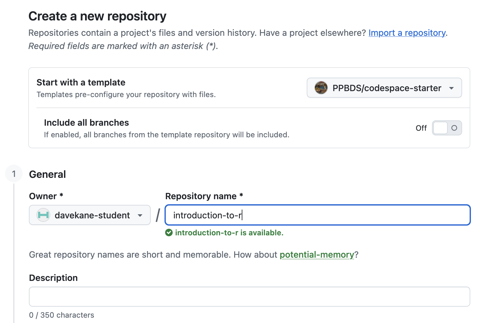
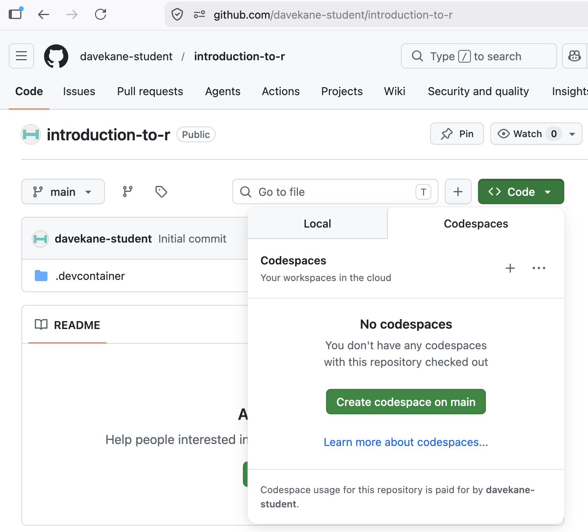

# Git and GitHub {.unnumbered}

By now you have completed four or five tutorials in **Start mode** --- the throwaway Codespace from the [Getting Started](getting-started.qmd) chapter --- downloading your answers each time. That is the fastest way to begin, and for those first tutorials it is all you need.

But a downloaded answers file is easy to lose, and a throwaway Codespace keeps nothing: the moment you delete it, everything you did inside is gone. As the tutorials get more involved, you will want to *keep* your work and build on it from one session to the next. That is what this chapter is about.

The tool for the job is a **repository** --- a "repo" --- a project that lives permanently in your own GitHub account. Recall from [Getting Started](getting-started.qmd) that GitHub organizes everything into repos. A repo you *own* is a permanent home for your work: anything you save to it stays there, available the next time you open a Codespace, and nothing is lost when a Codespace is deleted. Saving to a repo is done with **Git**, the version-control system built into VS Code's **Source Control** panel; GitHub is where those saved versions live online.

When a tutorial asks you to keep your work, you make a repository for it. The naming rule is simple: the repository name is the **tutorial id** --- the tutorial title in lowercase, with spaces replaced by dashes --- so "Probability" becomes `probability`, and so on.

There are two ways to create that repository:

- **Launch** *(recommended)* --- Launch the same fast, pre-built `codespace-starter` Codespace you already know, then run one command (`make_repo.sh`) that creates a repository you *own* and sets you up to work in it. You get the quick startup *and* a permanent home for your work.
- **Template** --- Use GitHub's "Use this template" button to copy `codespace-starter` into a repository you own, then launch a Codespace on that copy. It does the same job as Launch, but the first launch is **slow** (several minutes) because your copy has no pre-built image. We document it as a fallback; prefer **Launch**.

For a given tutorial you use Launch *or* Template, not both.

## Launch mode: your own repo, the fast way {.unnumbered}

**This is the recommended method for tutorials that need their own repository.** You launch the same fast, pre-built `codespace-starter` Codespace you used in Start mode, then run a single command that creates a repository you *own* and sets you up to work in it --- so you get the quick startup *and* a permanent home for your work.

The walkthrough below uses `my-tutorial` as a stand-in --- put the id of whatever tutorial you are on in its place.

### Launching the Codespace {.unnumbered}

Exactly as in Start mode: from [`https://github.com/PPBDS/codespace-starter`](https://github.com/PPBDS/codespace-starter), click the green **Code** button, switch to the **Codespaces** tab, and click **"Create codespace on main."**

When the Codespace finishes loading, the terminal greets you with a banner:

```
════════════════════════════════════════════════════════════
   ✅  YOUR CODESPACE IS READY

   Start your own project (creates a new repo):
       bash /workspaces/codespace-starter/.devcontainer/make_repo.sh <repo-name>

   Full guide: /workspaces/codespace-starter/.devcontainer/STUDENT_WORKFLOW.md

   Type `clear` to remove this banner.
════════════════════════════════════════════════════════════
```

That banner is also your "ready" signal: when it appears, every extension and R package is installed and the Codespace is fully set up. (If you want it gone, type `clear`, as it suggests.)

### Creating your repository {.unnumbered}

In the terminal, run the command the banner shows, using the tutorial id as the repository name:

```
bash .devcontainer/make_repo.sh my-tutorial
```

The **first time** you run this in a Codespace, you are asked to sign in to GitHub: a one-time code appears and a browser tab opens --- paste the code and click **Authorize**. This signs you in as *yourself*, which is what lets the Codespace create and save to your own repositories. (Out of the box, a Codespace launched on `codespace-starter` can only touch `codespace-starter`.) You do this **once per Codespace**.

When it finishes, a second banner confirms what happened:

```
════════════════════════════════════════════════════════════
   🎉  Created your repo: my-tutorial   (/workspaces/my-tutorial)

   👉 Open it:  File → Open Folder → /workspaces/my-tutorial
      (the editor may switch on its own; if not, use that menu)

   Then, working inside your repo:
   • Save your work:    commit + push  (Source Control panel, left)
   • Publish a graphic: see .devcontainer/STUDENT_WORKFLOW.md
════════════════════════════════════════════════════════════
```

Your repository now exists at `https://github.com/<your-username>/my-tutorial`, and a copy has been downloaded into the Codespace at `/workspaces/my-tutorial`.

### Opening your repository {.unnumbered}

Do the one manual step the banner points to: **File → Open Folder → `/workspaces/my-tutorial`**, and confirm in the dialog. (A Codespace will not reliably switch folders from a script, so you do this by hand.) The window reloads into your repository.

After the reload, the banner changes to show where you are:

```
════════════════════════════════════════════════════════════
   📂  Your repo: my-tutorial

   • Explorer shows my-tutorial?  You're in it — commit & push via
     the Source Control panel (left).
   • If not:  File → Open Folder → /workspaces/my-tutorial

   Guide: /workspaces/codespace-starter/.devcontainer/STUDENT_WORKFLOW.md
   Type `clear` to remove this banner.
════════════════════════════════════════════════════════════
```

Look at the **Explorer** in the upper left --- it should now read `MY-TUTORIAL`. You are working inside your own repository, and anything you commit and push from the **Source Control** panel is saved there permanently.

### Running the tutorial {.unnumbered}

Click the **R Tutorials** icon on the Activity Bar, click **[tutorial.helpers](https://ppbds.github.io/tutorial.helpers/)**, and start your tutorial --- the same way you started "Getting Started" in Start mode. Read and follow the instructions, and download your answers at the end.

Because this repository is *yours*, you can also save your work to GitHub: open the **Source Control** panel on the left, type a short message, and click **✓ Commit**, then **Sync Changes** (or **Publish Branch** the first time).

### Stopping the Codespace {.unnumbered}

When you are done, **stop** the Codespace (Command Palette → "Codespaces: Stop Current Codespace," or from your [Codespaces page](https://github.com/codespaces)). Your work is safe in your `my-tutorial` repository, so it is fine to reopen this Codespace later or to delete it --- deleting discards only the Codespace, never your pushed work. (As always, anything you have *not* committed and pushed is lost when a Codespace is deleted.)

## Template mode: your own repo, the slow way {.unnumbered}

**Launch mode (above) is the recommended way to create a tutorial repository.** Like Launch, this is only for the later tutorials that need their own repository. It produces the *same* kind of owned repository, but its first launch is **much slower**, so use it only as a fallback --- for a given tutorial you use Launch *or* Template, not both.

It works by copying `codespace-starter` into a repository you own. (The screenshots below were captured with an example repo name; use your tutorial's id.)

### Creating the repository from the template {.unnumbered}

Go back to [`https://github.com/PPBDS/codespace-starter`](https://github.com/PPBDS/codespace-starter). Click the green **"Use this template"** button at the top right and select **"Create a new repository."**

```{r}
knitr::include_graphics("git-and-github/images/new-2.png")
```

In the **Repository name** field, type the tutorial id (its title in lowercase, spaces replaced by dashes --- the same naming rule as Launch mode). Leave everything else at the defaults, then click **Create repository from template.**


```{r}

```

You now own a repository at `https://github.com/<your-username>/<tutorial-id>`. It is identical to `PPBDS/codespace-starter` but yours --- anything you do here can be saved permanently, unlike in a Start-mode Codespace.

### Launching a Codespace on your repo {.unnumbered}

From your new repository's page, click the green **Code** button, switch to the **Codespaces** tab, and click **"Create codespace on main."**

```{r}

```

This Codespace takes **several minutes longer** to launch than a Start- or Launch-mode one. The reason: `PPBDS/codespace-starter` has a pre-built container image, but your template copy does not, so the container builds from scratch the first time. (That slow build is exactly why we recommend Launch.) Subsequent launches of this *same* Codespace are fast.

### Running the tutorial {.unnumbered}

Once the Codespace is fully loaded, click the **R Tutorials** icon on the Activity Bar, click on **[tutorial.helpers](https://ppbds.github.io/tutorial.helpers/)**, and start your tutorial.

```{r}
knitr::include_graphics("git-and-github/images/new-5.png")
```

Read and follow the instructions. At the end, download your answers, and commit + push your work from the **Source Control** panel.

### Stopping the Codespace {.unnumbered}

When you are done, **stop** the Codespace --- via the Command Palette or your [Codespaces page](https://github.com/codespaces). Because your work lives in your own repository, your committed-and-pushed work is safe whether you stop, reopen, or delete the Codespace. (Anything you have *not* committed and pushed is lost on delete.)

## Summary {.unnumbered}

Once your work is worth keeping, you give it a permanent home in a **repository you own** on GitHub, named with the tutorial id (the title in lowercase, with spaces replaced by dashes). There are two ways to create one:

- **Launch** *(recommended)* --- launch the fast `codespace-starter` Codespace and run `make_repo.sh <tutorial-id>` to create and open your repo.
- **Template** *(slower fallback)* --- copy `codespace-starter` with "Use this template," then launch a Codespace on your copy.

Either way, you end up working inside your own repository, where **commit + push** from the **Source Control** panel saves your work permanently --- safe whether you stop, reopen, or delete the Codespace.
