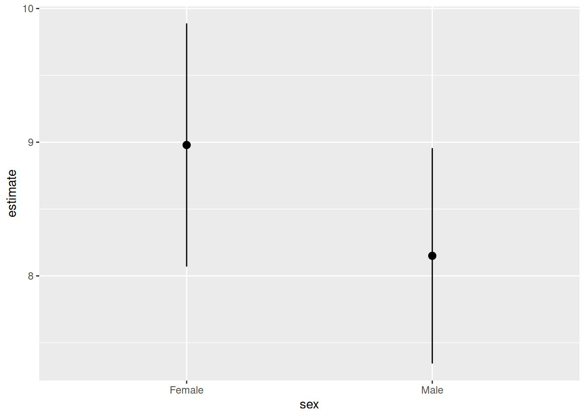
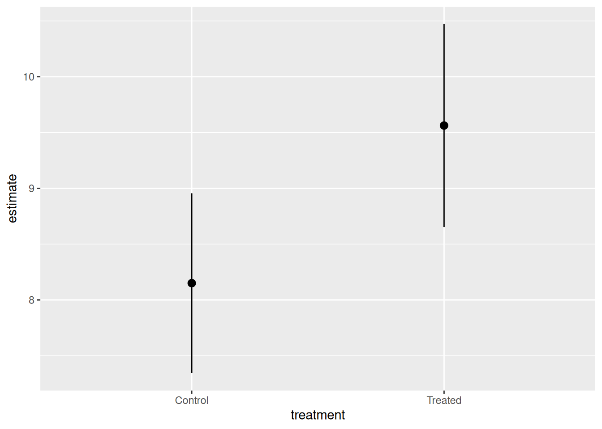
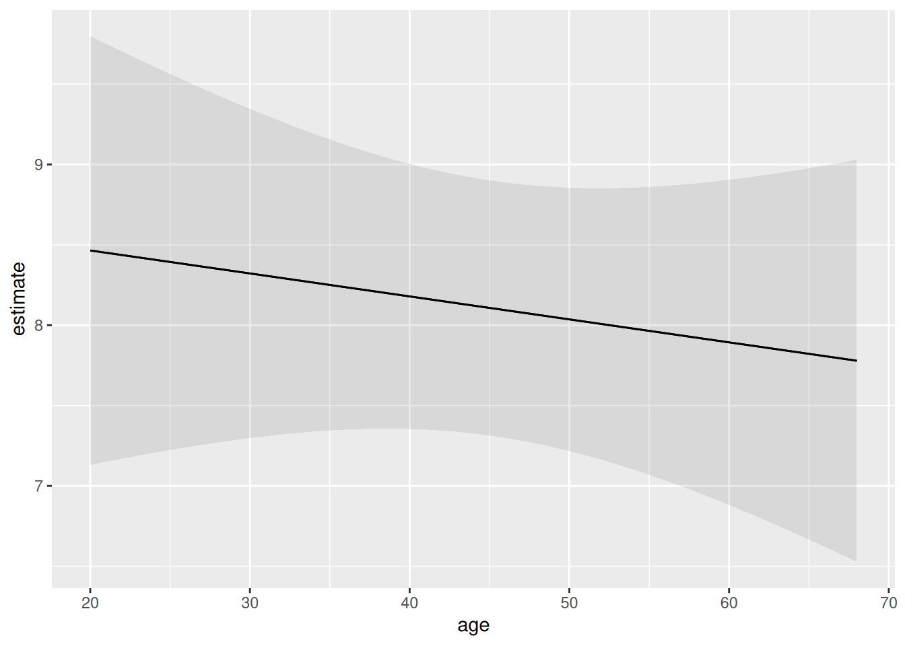
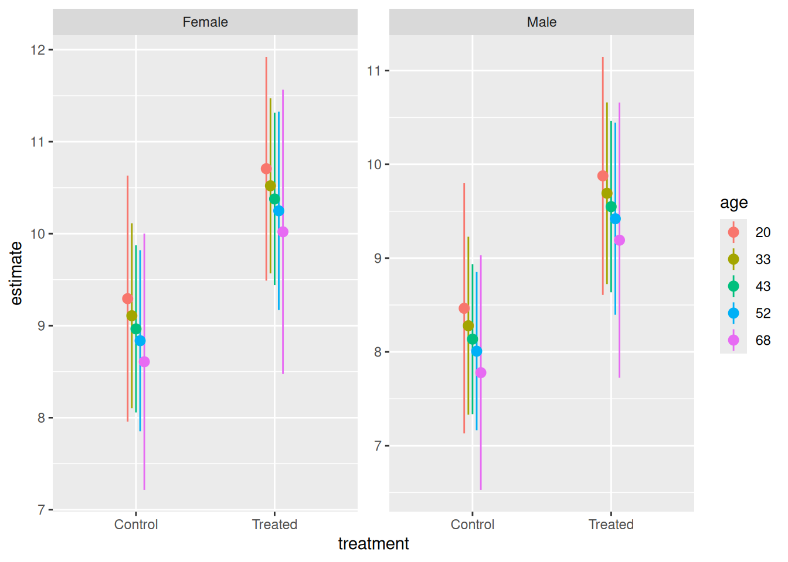
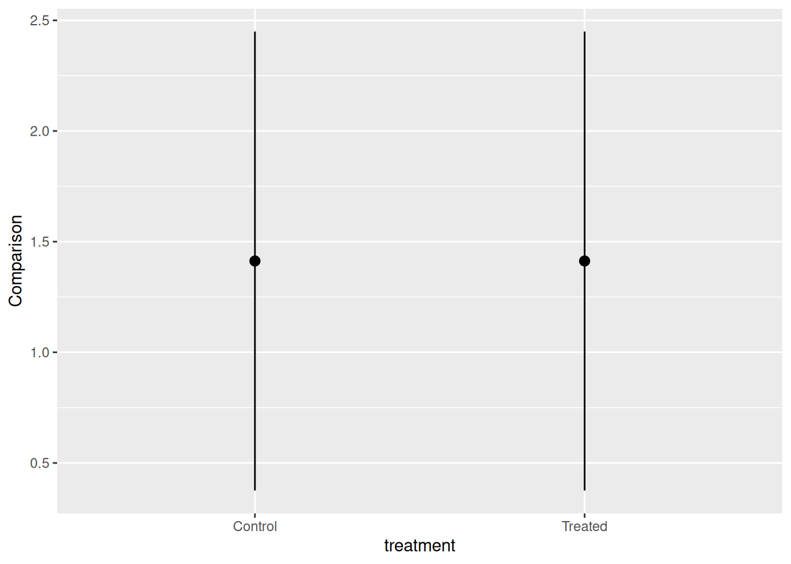

# Cardinal Virtues

In the spirit of transparency, here are the guidelines which we provide
to colleagues updating chapters in the
[*Primer*](https://ppbds.github.io/primer/) and writing tutorials in
this package. This is how we think data science ought to be taught. It
is also, perhaps unsurprisingly, how we think data science ought to be
done, at least at this introductory level. Key concepts are bolded when
they are first introduced.

## Introduction

The world confronts us. Make decisions we must.

Who am I and what problem am I trying to solve?

- Imagine that you are running for Governor of Texas in the next
  election. You have a campaign budget. Your goal is to win the
  election. Winning the election involves convincing people to vote for
  you *and* getting your supporters to vote. Should you send postcards
  to registered voters likely to vote for you? What should those
  postcards say?

- Imagine that you are in charge of ordering uniforms for bootcamp
  recruits in the Marine Corps for next year. There are many factors to
  consider: the cost of different designs, the number of male and female
  recruits, the distributions of heights and weights, and so on. What
  should you order?

- Imagine that you are a historian trying to understand the 1992 US
  Presidential election. Who voted? Who did they vote for? Why did they
  vote as they did? What might have led them to vote differently?

Of course, we are never going to be able to answer all those questions.
They are much too hard! But we should be able to make some progress, to
learn something about the world which will help us to make better
decisions.

## Wisdom

> Wisdom requires a question, the creation of a Preceptor Table, and an
> examination of our data.

**Wisdom** is the first [Cardinal
Virtue](https://en.wikipedia.org/wiki/Cardinal_virtues) in data science.
Begin with the quantity of interest. Is that QoI a causal effect or
simply a forecast? Which units and outcomes does it imply? What
Preceptor Table would allow you to calculate your QoI easily? Perform an
exploratory data analysis (EDA) on the data you have. The data might not
be able to answer the question you started with. But maybe it can answer
a related question which also matters. Changing the question changes the
Preceptor Table. Over time, using a iterative process, we finish with a
Precetor Table and a data set which work well together.

Once we have motivated the issue by imagining ourselves as a specific
person facing a collection of decisions, we can move onto a broad
question which, we hope, will be relevant. Examples:

> *How do voters respond to postcards?*

> *How does height vary by sex?*

> *What explains individual voting decisions in the 1992 US Presidential
> election?*

In order to make progress, you will then drill down to a more specific
question, one which specifies variables for which we actually have data.
The key refinement at this stage is that we have gone from general terms
to a variable with a specific definition, available in a data set to
which we have access. Examples:

> *What is the causal effect on voting behavior of receiving a postcard
> which specifies which of your neighbors voted in the last election?*

> *What is the height of young men and women in the US?*

> *How did the likelihood of voting for Bush/Clinton/Perot in the 1992
> US Presidential election vary by sex?*

With specific variables, we can construct a statistical model. That
statistical model can be used to answer all sorts of questions.

Of course, our data must contain the variables which allow us to answer
the question, otherwise we need a new question.

Specifics help you to fix ideas as you start to work on a project. Just
because you start looking for this number does not mean that we can’t
consider other questions.

Your interim goal is to provide an answer to the specific question,
along with your uncertainty about that answer. To calculate these, you
will create a series of models, the final version of which we refer to
as the data generating mechanism (DGM). Once you have the DGM, you can
not only answer that specific question. You can also answer lots of
similar questions, thereby allowing you to discuss the broader topic in
much more detail.

**Quantity of Interest** is the number that you want to estimate. It is
the answer to a specific question. You will almost always calculate a
posterior probability distribution for your Quantity of Interest since,
in the real world, you will never know your QoI precisely. Exploring the
general question will require the calculation of many Quantities of
Interest.

### Preceptor Table

> A Preceptor Table is the smallest possible table with rows and columns
> such that, if there is no missing data, our question is easy to
> answer.

**Predictive Models and Causal Models** are different because predictive
models have only one outcome column. Causal models have more than one
(potential) outcome column because we need more than one potential
outcome in order to estimate a *causal effect*. The first step in a data
science problem is to determine if your QoI requires a causal or a
predictive model.

If you don’t care what Joe would have done in a counter-factual world in
which he got a different treatment, if all you care about is predicting
what Joe does *given the treatment he received*, then you just need a
predictive model.

**Units** are determined by the original question, which also determines
the QoI. They are the **rows**, both in the *Preceptor Table* and in the
data.

**Variables** is the general term for the **columns** in both the
Preceptor Table and the data. In fact, the term is even more general
since it may refer to data vectors which we would like to have in order
to answer the question but which are, sadly, not available in the data.
The columns in the data are a subset of all the variables in which we
might be interested.

**The outcome** is the most important variable. It is determined by the
question/QoI. By definition, it must be present in both the data and the
Preceptor Table. Different problems might be answered with the same data
set, with different variables playing the role of the outcome in each
case.

**Covariates** is the general term for all the variables which are not
the **outcome**. As with **variables**, there are three different
contexts in which we might use the term covariates. First, covariates
are all the variables which might have some connection with our outcome,
even if they are not included in the data. Second, covariates are all
the variables in the data other than the outcome. Third, covariates can
refer to just the subset of the variables in the data which we actually
use in our model. The second usage is, obviously, a subset of the first,
and the third usage is a subset of the second.

**Units**, **outcomes** and **covariates** are important parts of every
data science model. Causal, but not predictive, models also include at
least one **treatment**, which is just a covariate which we can, at
least in theory, manipulate. The QoI determines the units and outcomes
for your model.

**Potential Outcome** is the outcome for an individual under a specified
treatment. A *potential outcome* is just a regular outcome in the case
of a causal model. In a predictive model, we just have an outcome. It is
just another variable, the one that, in the context of this problem, we
are interested in explaining/modeling/predicting. In a causal model, on
the other hand, there are at least two outcomes: the outcome which
happens if the unit gets the treatment and the outcome which happens if
that same unit gets the control. We refer to both of these outcomes as
*potential outcomes*.

**Causal Effect** is the difference between two potential outcomes.

[**Rubin Causal
Model**](https://en.wikipedia.org/wiki/Rubin_causal_model) is an
approach to the statistical analysis of cause and effect based on the
framework of potential outcomes.

To create the Preceptor Table, we answer a series of questions:

- C*ausal or predictive?* Look for verbs like “cause” or “affect” or
  “influence.” Look for a question which implies a comparison, *for a
  single individual unit*, between two states of the world, one in which
  the unit receives the treatment and one in which that same unit gets
  control. Look for a discussion of something which we can *manipulate*.
  Remember the motto: *No causation without manipulation*. We look to
  see if the question seeks to compare two potential outcomes *within
  the same unit*, rather than the same outcome between two different
  units.

If none of this is present, use a predictive model. If all you need to
know to answer the question is the outcome under one value of the
treatment, then the model is predictive. In that case, the treatment is
not truly a “treatment.” It is just a covariate. Example: What is the
`att_end` for all women if they were to get the treatment? This is a
predictive question, not a causal one, because we do not need to know
the outcome under treatment *and* under control for any individual
woman.

- *What is the moment in time to which the question refers?* Every
  question refers to a moment in time, even if that moment stretches a
  bit. The set of adults *today* is different from the set 10 years ago,
  or even yesterday. We need to *refine* the original question. Assume
  that we are referring to July 1, 2020 even though, in most cases,
  people are interested in *now*. We have changed the original question
  from:

> What proportion of people who make \$100,000 are liberal?

to

> On July 1, 2020, what proportion of people who made \$100,000 were
> liberal?

- *What are the units?* The question often makes this fairly clear, at
  least in terms of what each row corresponds to, whether it be
  individuals, classrooms, countries, or whatever. But, questions often
  fail to make clear the total number of the rows. Our example question
  above does not specify the relevant population. Is it about all the
  people in the world? All the adults? All the adults in the United
  States? The purpose of this paragraph is to *refine* the question, to
  make it more specific. Assume that we are interested in all the adults
  in Chicago. Our question now is:

> On July 1, 2020, what proportion of the adults in Chicago who made
> \$100,000 were liberal?

This back-and-forth between the question and the analysis is a standard
part of data science. We rarely answer the exact question we started
with, especially because that question is never specific enough to
answer without further qualifications. Furthermore, the data we have may
not allow us to answer that question, but it may be enough to answer a
related question. Is that good enough for the boss/client/colleague who
asked the original question? Maybe? You won’t know until you ask.

Our job as data scientists is not to simply answer the question we have
been asked, but to help the questioner determine a question which can be
answered with the data we have, a question which helps them to make the
decisions which they face.

- *What are the outcomes?* (If the model is causal, then there must be
  at least two potential outcomes. If you can’t figure them out, then
  the model is probably predictive.) If the model is predictive, then
  there is only one outcome. This paragraph does more than just name the
  relevant variable. It also starts the discussion about how exactly we
  might measure this variable. We consider both the underlying concept,
  “liberal,” and the process by which we might operationalize the
  concept. Perhaps we are using a written survey with a YES/NO answer.
  Perhaps it is an in-person interview with a 1-7 Likert scale, in which
  answers of 1 or 2 are coded, by us, as “liberal.” The details may or
  may not matter, but we at least need to discuss the issue.

- *What are the covariates?* Discussing covariates in the context of the
  Preceptor Table is different than discussing covariates in the context
  of the data. Recall that the Preceptor Table is the smallest possible
  table, so we don’t need to include every relevant variable. We only
  need to discuss variables that are necessary to answer the question.

- *What are the treatments, if any?* (There are no “treatments” in
  predictive models. There are only covariates.) A treatment is a
  covariate which, at least in theory, we can manipulate and the
  manipulation of which is necessary to answer our question.

With all the above, create the Preceptor Table. In this case, our
Preceptor Table includes `N` rows, one for every adult in Chicago on
July 1, 2020. It includes two columns: the outcome (`liberal`) and a
single covariate (`income`).

[TABLE]

If we have the Preceptor Table, with no missing data, then it is trivial
to calculate the percentage of adults (who make more than \$100,000) who
are liberal.

The Preceptor Table is, really, not the smallest possible table which
solved your problem. That would be a table with a single cell containing
the quantity of interest! This is, obviously, stupid. The Preceptor
Table is the smallest possible table, with rows corresponding to units
about which we have some information, which allows us to answer the
question.

### EDA

> You can never look at the data too much. – Mark Engerman

There is always a short section devoted to exploratory data analysis.
Each EDA will include at least one textual look at the data, usually
using [`summary()`](https://rdrr.io/r/base/summary.html), but with
`skim()`,
[`glimpse()`](https://pillar.r-lib.org/reference/glimpse.html),
[`print()`](https://rdrr.io/r/base/print.html) and
[`slice_sample()`](https://dplyr.tidyverse.org/reference/slice.html)
also available. It will also include at least one graphic, almost always
with the outcome variable on the y-axis and one of the covariates on the
x-axis. The data set will often include columns and rows which are
irrelevant to the question. Those columns and rows are removed, creating
a tibble which will be used in the Courage section. The name of that
tibble will often be something convenient like `ch_7`.

It also makes sense to include some discussion about where this data
comes from. What are the definitions of the variables? Who chose the
sample? Where is the documentation? This sort of background sets the
stage for examining validity.

### Conclusion

We conclude the Wisdom section by summarizing how we hope to use the
data we have to answer the question we started with. Example:

> Using data from a 2012 survey of Boston-area commuters, we seek to
> understand the relationship between income and political ideology in
> Chicago and similar cities in 2020. In particular, what percentage of
> individuals who make more than \$100,000 per year are liberal?

Note how the specific question has morphed into a general examination of
the “relationship” between income and political ideology. In order to
answer any specific question, we always have to examine a more general
relationship. We always have to build a model. We can then use this
model to answer both the question we started with as well as other
related questions.

By thinking hard about the original question and the data, we have come
up with a question which *may* be possible to answer with the data we
have. Note that each Cardinal Virtue section finishes with a sentence or
two summarizing what you have learned. Those sentences are combined at
the end of the analysis. One of the key products of a data science
project is a paragraph which summarizes the key conclusions.

## Justice

> Justice concerns the Population Table and the four key assumptions
> which underlie it: validity, stability, representativeness, and
> unconfoundedness.

**Justice** is the second [Cardinal
Virtue](https://en.wikipedia.org/wiki/Cardinal_virtues) in data science.
Justice starts with the Population Table – the data we want to have, the
data which we actually have, and all the other data from that same
population. Each row of the Population Table is defined by a unique
unit/time combination. We explore three key issues. First, does the
relationship among the variables demonstrate *stability*, meaning is the
model stable across different time periods? Second, are the rows
associated with the data and, separately, the rows associated with the
Preceptor Table, *representative* of all the units from the population?
Third, for causal models only, we consider *unconfoundedness*.

\### Validity

> Validity is the consistency, or lack thereof, in the columns of your
> data set and the corresponding columns in your Preceptor Table.

In order to consider the two data sets to be drawn from the same
population, the columns from one must have a *valid correspondence* with
the columns in the other. Validity, if true (or at least reasonable),
allows us to construct the *Population Table*, which is the first step
in Justice.

Validity discussions always have one (short) paragraph about each
relevant variable (the outcome and any relevant covariates), with
examples of why validity might *not* hold. Validity discussion finishes
with a brief discussion along the lines of: “Despite these concerns, we
will assume that validity does hold.”

These sections can be longer of course, depending on how many details
you discussed during the EDA. The central point is that we have two
(potentially!) completely different things: the Preceptor Table and the
data. *Just because two columns have the same name does not mean that
they are the same thing.* Indeed, they will often be quite different!
But because we control the Preceptor Table and, to a lesser extent, the
original question, we can adjust those variables to be “closer” to the
data that we actually have. This is another example of the iterative
nature of data science. If the data is not close enough to the question,
then we check with our boss/colleague/customer to see if we can modify
the question in order to make the match between the data and the
Preceptor Table close enough for validity to hold.

### Population Table

> The Population Table includes a row for each unit/time combination in
> the underlying population from which both the Preceptor Table and the
> data are drawn.

The **Population Table** can be constructed if the validity assumption
is (mostly) true. It includes all the rows from the Preceptor Table. It
also includes the rows from the data set. It usually has other rows as
well, rows which represent unit/time combinations from other parts of
the population.

If validity holds, then we can create a Population Table.

[TABLE]

- The “Source” column highlights that the Population Table includes
  three categories of rows: the data, the Preceptor Table, and the rest
  of the population, from which both the data and the Preceptor Table
  are drawn. The `...` indicates rows from the population which are not
  included in either the data or the Preceptor Table.

- The “ID” column is implicit, and often not included. After all, it
  should be obvious that each row refers to a specific unit. If we don’t
  really care about the individual units, there is no need to label
  them.

- There should always be a column, in this case “Year,” which indicates
  the moment in time at which the covariates were recorded. A given unit
  may appear in multiple rows, with each row providing the data at a
  different time. In this example, we will have a row for Sarah in 2012,
  when she was 43, and a row for Sarah in 2020, when she was 51, and so
  on. Note that Sarah might just be a member of the population, neither
  in the data we have nor in the Preceptor Table. Or she might be in one
  or the other. We are rarely concerned with any specific individual.

- Each row in the Population Table represents a unique Unit/Time
  combination.

- The “Outcome” column is the variable which we are trying to
  understand/explain/predict. There is always an outcome column,
  although it will often just be labelled with the variable name, as
  here with “Income.”

- The “Covariates” are all the columns other than those already
  discussed.

### Stability

> Stability means that the relationship between the columns in the
> Population Table is the same for three categories of rows: the data,
> the Preceptor Table, and the larger population from which both are
> drawn.

If the assumption of stability holds, then the relationships between the
columns in the Population Table is the same *across time*. First, the
relationship among columns from the same moment in time as the data is
the same as the relationship among columns for the entire table. Second,
the relationship among columns from the same moment in time as the
Preceptor Table is the same as the relationship among columns for the
entire table.

Stability, if true, allows is us to go from the data to the population,
and from the population to the Preceptor Table.

We discuss at least one example of why stability might *not* hold in
this case. These examples are almost always connected to the passage of
time. Whatever the relationship between political ideology and income
that might have held in 2012, when we gathered our data, might not be
true either before or afterwards. Provide specific speculations about
what might have changed in the world.

Regardless of those concerns, we always conclude that, although the
assumption of stability might not hold perfectly, the world is probably
stable enough over this time period to make inference possible.

*The longer the time period covered by the Preceptor Table (and the
data), the more suspect the assumption of stability becomes.*

### Representativeness

> Representativeness, or the lack thereof, concerns two relationships
> among the rows in the Population Table. The first is between the data
> and the other rows. The second is between the other rows and the
> Preceptor Table.

Ideally, we would like both the Preceptor Table *and* our data to be
random samples from the population. If so, then the assumption of
representativeness is met. Sadly, this is almost never the case.

Stability looks across time periods. Representativeness looks within
time periods.

We mention specific examples of two potential problems. First, is our
data representative of the population? Rarely! Second, are the rows
associated with the Preceptor Table representative of the population?
Again, almost never!

Provide specific examples of how a lack of representativeness might be a
problem, one large enough to affect your ability to answer the question.

But, to continue the analysis, we always assume/pretend that the rows
from both the data and the Preceptor Table are representative *enough*
of the relevant time period from within the larger population from which
both are drawn.

### Unconfoundedness

> Unconfoundedness means that the treatment assignment is independent of
> the potential outcomes, when we condition on pre-treatment covariates.
> A model is *confounded* if this is not true.

This assumption is only relevant for causal models. We describe a model
as “confounded” if this is not true. The easiest way to ensure
unconfoundedness is to assign treatment randomly.

If the model is predictive, then unconfoundedness is not a concern. Just
mention that fact in a sentence at the end of the section on
representativeness. But, if the model is causal, then we need a section
devoted to this topic.

If treatment assignment was random, then unconfoundedness is guaranteed,
although experienced researchers often worry about the exact process
involved in such “random” assignment. If, however, treatment assignment
was not random, then there will always be a concern that it is
correlated with potential outcomes. Discuss at least two scenarios in
which this might be a concern. But then, as usual, conclude that,
although there might be some issues with confoundedness, they are
probably small enough to not worry about.

Just because Wisdom points us toward a Population Table with $N$ rows
does not mean we need to keep all $N$ rows, especially if creating a
model which covers all rows is hard/impossible. We can just simplify the
claims we are making about the world by removing some rows. Getting rid
of rows will usually necessitate an adjustment to the question we are
trying to answer. Again, data science is an iterative process.

The Justice section concludes with a sentence or two about how, despite
any problems with the four assumptions of validity, stability,
representativeness and unconfoundedness, we can still proceed to next
steps because the assumptions hold enough.

The last step is to revisit the key sentences from the Wisdom section.
Recall:

> *Using data from a 2012 survey of Boston-area commuters, we seek to
> understand the relationship between income and political ideology in
> Chicago and similar cities in 2020. In particular, what percentage of
> individuals who make more than \$100,000 per year are liberal?*

Are these sentences still correct, or does a serious consideration of
the assumptions of validity, stability, representativeness and
unconfoundedness require us to modify them? The answer, of course, is
that the assumptions are never perfect! So, we have an obligation to add
a sentence or two which highlights (no more than) one or two concerns.
Examples:

> *There is some concern that survey participants may not be perfectly
> representative of the underlying population.*

> *The relationship between income and ideology may have changed over
> that eight year period.*

There is no need to use technical terms like “stability.” However, most
readers will understand what “representative” means. The key point is
*honesty*. We have an obligation to at least mention some possible
concerns. Our new paragraph:

> *Using data from a 2012 survey of Boston-area commuters, we seek to
> understand the relationship between income and political ideology in
> Chicago and similar cities in 2020. In particular, what percentage of
> individuals who make more than \$100,000 per year are liberal? The
> relationship between income and ideology may have changed over that
> eight year period.*

## Courage

> Courage starts with math, explores models, and then creates the Data
> Generating Mechanism.

**Courage** is the third [Cardinal
Virtue](https://en.wikipedia.org/wiki/Cardinal_virtues) in data science.
Justice gives us the Population Table. Courage creates the data
generating mechanism. We first specify the mathematical formula which
connects the outcome variable we are interested in with the other data
that we have. We explore different models. We need to decide which
variables to include and to estimate the values of unknown parameters.
We check our models for consistency with the data we have. We avoid
hypothesis tests. We select one model, the data generating mechanism.

Courage begins by a discussion of the functional form we will be using.
This is usually straight-forward because it follows directly from the
type of the outcome variable: continuous means a linear model, two
categories (binary) implies logistic, and more-than-two categories
suggests multinomial logistic. We provide the mathematical formula for
this model, using `y` and `x` as variables. We don’t yet know the number
of right-hand side variables to include, much less which ones. So, the
formula is generic.

The rest of the discussion is broken up into three sections: “Models,”
“Tests,” and “Data Generating Mechanism.”

### Models

When exploring different models, we need to decide which variables to
include and to estimate the values of unknown parameters. We estimate
the models and then print out the model results. We do not give another
version of the math, or use `tbl_regression()` yet. The goal is to
explore and interpret different models.

If a parameter’s estimated value is more than 2 or 3 standard errors
away from zero, we generally keep that parameter (and its associated
variable) in the model. This is, probably, a variable which “matters.”
The main exception to this rule is a parameter whose value is so close
to zero that changes in its associated variable, within the general
range of that variable, can’t change the value of the outcome by much.

Depending on the chapter, we will use different tools to choose among
the different possible models.

#### Interpreting Parameters

Interpreting the meaning of parameter estimates takes practice. Consider
a simple linear model.

``` r
linear_reg(engine = "lm") |>
  fit(att_end ~ sex + treatment + age, data = trains) |>
  tidy(conf.int = TRUE, digits = 2) |>
  select(term, estimate, conf.low, conf.high)
```

    # A tibble: 4 × 4
      term             estimate conf.low conf.high
      <chr>               <dbl>    <dbl>     <dbl>
    1 (Intercept)        9.58     7.51     11.6
    2 sexMale           -0.829   -1.86      0.207
    3 treatmentTreated   1.41     0.364     2.46
    4 age               -0.0143  -0.0572    0.0286

Let’s go through some example Q&A, followed by commentary:

**Q:** Write a sentence interpreting the -0.83 estimate for `sexMale`.

**A:** When comparing men with women, men have a 0.83 lower value for
`att_end`, meaning that they are more liberal about immigration,
relative to women, conditional on the other variables in the model.

Whenever we consider non-treatment variables, we must never use terms
like “cause,” “impact” and so on. We can’t make any statement which
implies the existence of more than one potential outcome based on
changes in non-treatment variables. We can’t make any claims about
within row effects. Instead, we can only compare across rows. Always use
the phrase “when comparing X and Y” or something very similar.

The phrase “conditional on the other variables in the model” is
important. It could be shortened to “conditional on the model.” This
phrase acknowledges that there are many, many possible models, just
considering all the different combinations of independent variables we
might include. Each one would produce a different coefficient for
`sexmale`. None of these is the *true* coefficient. Any claim we make
about -0.83, or any specific number, is always conditional on the fact
that we assume that this model is true, that these covariates, and no
others, belong in the regression. Does that mean that we always use the
phrase? No. We leave it out all the time. But it is always understood to
be there by knowledgeable readers.

**Q:** Write a sentence interpreting the confidence interval for
`sexMale`.

**A:** We do not know the true value for the coefficient for `sexMale`,
but we can be 95% confident that it lies somewhere between -1.86 and
0.21.

Because we are Bayesians, we believe that there is a true value and that
the confidence or credible or uncertainty interval includes it at the
stated level.

Most of the time parameters in a model have no direct relationship with
any population parameter in which we might be interested. This is
especially true in complex and/or non-linear models. That is, in those
cases, a coefficient like $\beta_{1}$ does not “mean” anything. But, in
simple, small, linear models, it sometimes happens that a parameter does
correspond to something real. In this case, the coefficient of `sexmale`
is the difference between the population average of `att_end` for men
and women, adjusting for the other variables in the model.

**Q:** Interpret the 1.41 estimate for `treatmentTreated`.

**A:** If this is a causal model, then the average causal effect of
receiving the treatment of hearing Spanish-speakers on the train
platform, relative to the control, is to have a 1.41 higher value for
`att_end`, meaning that the treatment, relative to the control, makes
one more conservative about immigration.

**A:** If this is a predictive model, then, if we compare people who
receive the treatment with people who receive the control, the treated
people have, on average, a 1.41 more conservative attitude toward
immigration, adjusting for other individual characteristics.

The interpretation of a treatment variable is very different than the
interpretation of a standard covariate. The key point is that there is
no such thing as a causal (versus preditive) data set nor a causal
(versus predictive) R code formula. You can use the same data set (and
the same R code!) for both causal and predictive models. The difference
lies in the assumptions you make.

**Q:** Interpret the 0.36 to 2.46 interval for the `treatmentTreated`
coefficient.

**A:** Our best estimate for the average causal effect is 1.41, meaning
that being treated makes someone 1.41 units more conservative about
immigration. Yet, the true value could be lower or higher. We are 95%
certain that the true effect is somewhere between 0.36 to 2.46.

**Q:** Interpret the -0.01 estimate for `age`.

**A:** If we compare one group of people ten years older than another,
the older group will, on average, have an attitude toward immigration
0.1 unit lower, i.e., less conservative.

Numeric variables are harder than binary variables because there are no
longer just two well-defined groups to compare with each other. We must
create those two groups ourselves. Fortunately, as long as there are no
interaction terms, we can just pick two groups with any values for the
variable. The most common two groups differ by one unit of the variable.
But it is quite common to use groups which differ by more/less if doing
so seems sensible and/or if it makes the math easier. In this case, two
groups which differ by 10 years makes sense for both reasons.

What about non-linear models, or linear models with lots of interaction
terms?

``` r
logistic_reg(engine = "glm") |>
  fit(as.factor(arrested) ~ sex + race, data = stops) |>
  tidy(conf.int = TRUE) |>
  select(term, estimate, conf.low, conf.high)
```

    # A tibble: 7 × 4
      term         estimate conf.low conf.high
      <chr>           <dbl>    <dbl>     <dbl>
    1 (Intercept)   -2.56    -2.69     -2.44
    2 sexmale        0.368    0.352     0.385
    3 raceblack      1.19     1.07      1.31
    4 racehispanic   0.805    0.674     0.939
    5 raceother      0.337   -0.0537    0.700
    6 raceunknown   -0.0824  -0.262     0.0965
    7 racewhite      0.928    0.806     1.05  

With a linear model, all these interpretations are fairly
straightforward. With any other type of model, the math is too difficult
to do in your head. You can’t just look at a coefficient of 5 and know
what it means in magnitude. But you can tell the direction, that a
positive 5 means that higher values of the covariate are associated with
higher values of the outcome variable. So, with anything other than
linear models, we restrict ourselves to direction and significance
interpretations.

**Q:** Write a sentence interpreting the 0.37 estimate for `sexmale`.

**A:** In comparison with women, men are more likely to be arrested.

Categorical variables (with $N$ categories), like sex (with two values),
are always replaced with ($N - 1$) 0/1 dummy variables like `sexMale`.

We can’t (easily) know how big 0.37 is. Because the model is non-linear,
you can’t (easily) determine whether men are 1% or 50% more likely to be
arrested.

**Q:** Write a sentence interpreting the 1.07 to 1.31 confidence
interval for `raceblack`.

**A:** In comparison with Asian/Pacific Islanders, Blacks are more
likely to be arrested. In fact, they are more likely to be arrested than
any other racial group.

Dummy variables must always be interpreted in the context of the base
value for that variable, which is generally included in the intercept.
For example, the base value here is “asian/pacific islander.” (The base
value is the first alphabetically by default for character variables.
However, if it is a factor variable, you can change that by setting the
order of the levels by hand.)

We look for two things in the confidence interval. First, does it
exclude zero? If not, then we can’t be sure if the relationship is
positive or negative. Second, does it overlap with the confidence
intervals for other dummy columns derived from this variable? If so,
then we can be sure that the ordering as to which comparisons are
bigger. If there is overlap, as for example between `raceother` and
`raceunknown`, we can’t be sure how the average comparison would go.
Because the estimate for `raceother` is larger than the estimate for
`raceunknown`, our best guess is that members of the former group are
more likely to be arrested. But, because the confidence intervals
overlap, there is a good chance (more than 5% certainly) that the
ordering is the opposite.

We recommend the verb “adjust” in place of “control” when discussing the
effect of including other variables in the model. Example: “The causal
effect of exposure to Spanish-speakers is 1.5, adjusting for other
variables like age and party.” The word “adjusting” is better than the
word “controlling” because it demonstrates some humility.

The more advanced our models, the less relevant are these sorts of
interpretations. After all, we don’t really care about parameters, much
less how to interpret them. Parameters are imaginary, like unicorns. We
care about answers to our questions. Parameters are tools for answering
questions. They aren’t interesting in-and-of themselves. *In the modern
world, all parameters are nuisance parameters.*

### Tests

We check our models for consistency with the data we have using
posterior predictive testing. We avoid hypothesis tests.

### Data Generating Mechanism

**Data Generating Mechanism** (DGM) is also called the data generating
model or the [data generating
process](https://en.wikipedia.org/wiki/Data_generating_process). The
*true* DGM is the reality of the world, the physical process which
actually generates the data which we observe. The *estimated* DGM is the
mathematical formula we create which models the true DGM, which we can
never know. In Temperance, we will use the estimated DGM to draw
inferences about our Quantities of Interest.

We create a final model, the data generating mechanism. We provide the
math for this model, using variable names instead of `y` and `x` as we
did at the start of the chapter. We present the final parameter
estimates nicely, using the **gtsummary** package.

The model you have made by the end of Courage is almost always too
complex to answer the simple question you started with, because the
question rarely specifies the values of all the covariates which are
included in the model. But any covariates or treatments which are part
of the initial question(s) must be included in the model, otherwise we
can’t answer any questions about them at all.

The DGM section ends with a clear statement in English, in its own
paragraph, describing the model. That is, what are the two sentences
which a student would say at a presentation describing the model. The
first sentence specifies the model, including making clear the units,
outcome and key covariates. (No need to use the terms “units,”
“outcomes,” and so on.) The second sentence tells us something about the
model, generally the relationship between one of the covariates and the
outcome variable. In general, there is no discussion of specific numbers
or their uncertainty. First, who cares? Parameter estimates are boring
and irrelevant. Second, the Temperance section is where we answer the
original question. Example:

> *We modeled being liberal, a binary TRUE/FALSE variable, as a logistic
> function of income. Individuals with higher income were more likely to
> be liberal.*

Update our concluding paragraph with this addition:

> *Using data from a 2012 survey of Boston-area commuters, we seek to
> understand the relationship between income and political ideology in
> Chicago and similar cities in 2020. In particular, what percentage of
> individuals who make more than \$100,000 per year are liberal? The
> relationship between income and ideology may have changed over that
> eight year period. We modeled being liberal, a binary TRUE/FALSE
> variable, as a logistic function of income. Individuals with higher
> income were more likely to be liberal.*

Feel free to use “I” instead of “We” if the project is solo.

## Temperance

> Temperance uses the Data Generating Mechanism to answer the questions
> with which we began. Humility reminds us that this answer is always a
> lie. We can also use the DGM to calculate many similar quantities of
> interest, displaying the results graphically.

**Temperance** is the fourth [Cardinal
Virtue](https://en.wikipedia.org/wiki/Cardinal_virtues) in data science.
Courage gave us the data generating mechanism. Temperance guides us in
the use of the DGM — or the “model” — we have created to answer the
questions with which we began. We create posteriors for the quantities
of interest. We should be modest in the claims we make. The posteriors
we create are never the “truth.” The assumptions we made to create the
model are never perfect. Yet decisions made with flawed posteriors are
almost always better than decisions made without them.

The two sub-sections of Temperance are: Questions and Answers, and
Humility.

It is important to monitor our language. We do not believe that changes
in `election_age` “cause” changes in `lived_after`. That is obvious. But
there are some words and phrases — like “associated with” and “change
by” — which are too close to causal. Be wary of their use. *Always think
in terms of comparisons when using a predictive model.* We can’t change
`election_age` for an individual candidate. We can only compare two
candidates (or two groups of candidates).

### Questions and Answers

We go back to the question(s) with which we started the journey. We
discuss how that question has evolved, in a back-and-forth process by
which we try to ensure that the data we have and the question we ask are
close enough to make the process plausible.

We revisit the Preceptor Table, at least conceptually. We emphasize that
the DGM allows us to fill in missing outcomes in the Preceptor Table,
thereby allowing us to answer our questions.

Key issue is the connection between the DGM (either true or estimated)
and the Preceptor Table. The connection is tricky! Not even sure I
understand it. The DGM can be used to “fill in” all the missing elements
of the Preceptor Table, but there will always be some associated
uncertainty. Even with the true DGM, we don’t know what `att_end` Joe
would have had under treatment, we just have a posterior for that
variable, a way to make draws.

Idea: Use the DGM to create one complete Preceptor Table. In that draw,
Joe is a 6 for `att_end`. Then, do another draw. Joe is a 5. Do a
thousand draws. You then have a thousand Preceptor Tables. Calculate the
Quantity of Interest for each Preceptor Table. The 1,000 values are the
posterior for your QoI.

Would be great to make a cool animation of this, perhaps with a simple
example. Would be fun to have a similar animation for each chapter.
Great summer project!

We use the data generating mechanism from Courage to answer the
question. This is, obviously, the core of the Temperance section.

#### Plots from **marginaleffects**

We walk the student through several plots created with the
**marginaleffects** package. The plots are generally increasing in
complexity. We always tell the student which plot to create by giving
them the exact code. If possible, the knowledge drop tries to connect
the plot to the table of regression results we interpreted above.
Example:

``` r
fit_attitude <- linear_reg(engine = "lm") |>
  fit(att_end ~ sex + treatment + age, data = trains)
```

**Example 1**

``` r
plot_predictions(fit_attitude,
                 condition = "sex")
```



This plot shows the expected value of attitudes toward immigration,
conditional on the model, for women and men. Women have higher (more
conservative) attitudes toward immigration, adjusting for age and
treatment. This is consistent with the negative estimated coefficient
for `sexMale` of -0.83.

**Example 2**

``` r
plot_predictions(fit_attitude,
                 condition = "treatment")
```



This plot shows the expected value of attitudes toward immigration,
conditional on the model, for those exposed to treatment
(Spanish-speakers on the train platform) and control. Treated
individuals have higher (more conservative) attitudes toward
immigration, adjusting for age and sex This is consistent with the
positive estimated coefficient for `treatmentTreated` of 1.41.

**Example 3**

``` r
plot_predictions(fit_attitude,
                 condition = "age")
```



This plot shows the expected value of attitudes toward immigration,
conditional on the model, for individuals of different ages. Younger
people have higher (more conservative) attitudes toward immigration,
adjusting for treatment and sex This is consistent with the negative
estimated coefficient for `age` of -0.01.

**Example 4**

``` r
plot_predictions(fit_attitude,
                 condition = c("treatment", "age", "sex"))
```



This plot shows the expected value of attitudes toward immigration,
conditional on the model, for individuals of different treatment
assignments, ages and sexes.

We are often just as interested in *comparisons* as we are in
*predictions*. It is tempting to think that we can deduce comparisons by
just subtracting one prediction from another. This mostly works for the
center of the distribution but it definitely does not work for the
confidence interval. Fortunately, **marginaleffects** provides the
`plot_comparison()` function for this purpose.

**Example 5**

``` r
plot_comparisons(fit_attitude,
                 variables = "treatment",
                 condition = "treatment")
```



This plot shows the expected value of the *difference* in attitudes
toward immigration between Treated and Control, conditional on the
model. Treated have higher (more conservative) attitudes toward
immigration, adjusting for age and sex. This is consistent with the
negative estimated coefficient for `treatmentTreated` of 1.41.

The relationship between `plot_predictions()` and `plot_comparisons()`
is subtle, but the central point is that, if you want to look at the
difference or ratio or any other function of more than one expected
value, you must use `plot_comparisons()`.

Further comments on `plot_comparisons()`:

- The values for the `condition` argument determine the structure of the
  plot. The first value is the x-axis, the second is the color and the
  third separates the plots into different panes.

- The value for the `variables` argument specifies the variable around
  which any *comparisons* are organized.

- If a model is not *rich* enough — meaning enough
  terms/interactions/non-linearities — there won’t be enough complexity
  for a complex call to `plot_comparisons()`.

The section always concludes with a one sentence summary of our final
conclusion. This summary does not include any technical terms. It is
meant for non-statisticians. It is something which we might say in
explaining our take-away conclusion to a non-statistician. It will
always feature at least one number, and our uncertainty associated with
that number. Example:

> *55% ($\pm$ 2%) of the people who make more than \$100,000 per year
> are liberal.*

or

> *Of the people making \$100,000 or more per year, about 55% are
> liberal, although the true number could be as low as 53% or as high as
> 57%.*

#### Scaling the QoI

Some cases, like these, feature numbers which have a natural
interpretation. We know what percentages are. But many outcomes are
measured in units which are more difficult to interpret. For example:

> *The causal effect of smaller class size on math exam scores was 10
> points.*

The reader does not know if 10 points is a big or small effect because
she doesn’t know anything about the range of scores which students get
on this exam. The most common approach to this problem is to
“standardize” the causal effect by dividing by the standard deviation of
the outcome. For example, if the standard deviation of all the math exam
scores is 50, then we would re-write this as:

> *The standardized causal effect of smaller class size on math exam
> scores was 0.2.*

Depending on the field, there are a variety of terms for describing a
raw causal effect divided by the standard deviation, including “sigmas”
— derived from the use of the Greek letter $\sigma$ as a symbol for the
standard deviation. So, we might also write:

> *The causal effect of smaller class size on math exam scores was 0.2
> sigmas.*

The raw effect size of 10 is 20% a standard deviation (50). If it were
50, we would speak instead one “one sigma” which is one standard
deviation.

Another common term for this divide-by-the-standard deviation
standardization is “effect size.” So:

> *The effect size of smaller class size on math exam scores was 0.2.*

Here is another approach for tackling a problem in which the scale does
not have a natural interpretation. Consider:

> *The causal effect of hearing Spanish-speakers is a more conservative
> attitude toward immigration, a change of about 1.5 ($\pm$ 0.5) on a 15
> point scale.*

This is correct, as far as it goes, but we have no idea if 1.5 is a
“big” or “small” change. We need some perspective.

> *The causal effect of hearing Spanish-speakers is a more conservative
> attitude toward immigration, a change of about 1.5 ($\pm$ 0.5) on a 15
> point scale. For perspective, the difference between Democrats and
> Republicans on that same scale is about 2.1.*

#### Confidence/Credible/Uncertainty Intervals

Terminology is important. The best words depend on your audience. An
example involves how you describe your uncertainty, the interval around
your best estimate of the quantity of interest. The terminology above —
1.5 ($\pm$ 0.5) — works well for a general audience. But you may want to
be more precise as to the meaning of that interval. Consider some
options:

- *95% interval of 0.5 to 1.5*. The use of the word “interval,” without
  an associated adjective, is a way to avoid the entire debate. The
  meaning is almost certainly the Bayesian one: The 95% percentile range
  on my posterior for the true causal effect goes from 0.5 to 1.5.

- *95% confidence interval of 0.5 to 1.5*. The adjective “confidence” is
  used by two different sorts of people. First are Frequentists, whose
  philosophy is the traditional approach to statistics and still in
  control at institutions like the College Board. The Frequentist
  meaning is that, if we followed the same approach in 100 similar
  problems then, 95% of the time, our confidence interval would include
  the true value. If you don’t understand this, don’t worry. You will
  never work for a Frequentist. The second sort of person who uses the
  adjective “confidence” is someone who is actually Bayesian, like us,
  but doesn’t care about annoying Frequentists.

- *95% credible interval of 0.5 to 1.5*. The adjective “credible” is the
  [Bayesian analogue](https://en.wikipedia.org/wiki/Credible_interval)
  to “confidence.” Other
  [Bayesians](https://statmodeling.stat.columbia.edu/2022/04/05/confidence-intervals-compatability-intervals-uncertainty-intervals/)
  who don’t want to annoy Frequentists will often replace “confidence”
  with “uncertainty” to be polite. But, being Bayesians, their meaning
  is always the same: There is a 95% chance that the true value is
  between 0.5 and 1.5.

The main takeaway is that the vast majority of people will not care if
you use “confidence interval” or “credible interval” or “uncertainty
interval.” They will interpret any of these phrases in the Bayesian way:
there is an X% chance — where X is most often 95 but can take on other
values — that the true value lies within the interval.

#### Final Paragraph

Depending on the context, you might have more than one Quantity of
Interest to discuss. But there must be at least one. You are now ready
to provide the entire concluding paragraph.

> *Using data from a 2012 survey of Boston-area commuters, we seek to
> understand the relationship between income and political ideology in
> Chicago and similar cities in 2020. The relationship between income
> and ideology may have changed over that eight year period. We modeled
> the status of having a liberal political orientation, a binary
> TRUE/FALSE variable, as a logistic function of income. Individuals
> with higher income were more likely to be liberal. Of the people
> making \$100,000 or more per year, about 55% are liberal, although the
> true number could be as low as 53% or as high as 57%.*

Note that we have deleted the rhetorical question — “In particular, what
percentage of individuals who make more than \$100,000 per year are
liberal?” — from the start of the paragraph. It is no longer necessary.

The final result of data science project is a paragraph like this one.
Data science begins with a question and some data. It ends with a
paragraph and, ideally, some graphics.

Of course, real data science projects never involve a single question.
Instead, the starting question leads you to create a DGM which can
answer it but which also can answer lots and lots of other questions.
Which is cool. In fact, it is often possible to create a graphic which
answers lots of questions at once. That is ideal. (The Michigan postcard
example is great.)

A really good data science project always ends with a cool graphic which
answers lots of questions and a paragraph like the one above which picks
out one answer to highlight.

The Questions and Answers section ends with that final paragraph.

### Humility

Temperance guides us in the use of the DGM to answer the questions with
which we began.

The Humility section always begins with single sentence, something along
the lines of:

*We can never know the truth.*

Over time, we hope to collect a serious of quotations along this theme.

Having answered the question, we now (quickly) review all the reasons
why our answer might be wrong. Review the *specific* concerns we had
about validity, stability, representativeness, and (if a causal model)
unconfoundedness. Those concerns remain.

Review the three levels of “truth”: Knowing all the entries in the
Preceptor Table, knowing the true DGM, and then using our estimated DGM.
(This explanation can become more sophisticated as the chapters
progress.)

We can never know all the entries in the Preceptor Table. That knowledge
is reserved for God. If all our assumptions are correct, then our DGM is
true, it accurately describes the way in which the world works. There is
no better way to predict the future, or to model the past, than to use
it. Sadly, this will only be the case with toy examples involving things
like coins and dice. We hope that our DGM is close to the true DGM but,
since our assumption are never perfectly correct, our DGM will always be
different. The estimated magnitude and importance of that difference is
a matter of judgment.

The problem with our concluding paragraph is that it implies that our
DGM is the truth, rather than just an imperfect approximation of the
true DGM. There are two main ways in which are DGM might be wrong.
First, the central portion of our estimate, 55% in this case, might be
wrong. We might be biased low or high. It is hard to know what to do
about that, other than to be aware.

The second way that our DGM might be wrong, relative to the true DGM, is
that our uncertainty interval, the 4% from 53% to 57%, might be off. It
might be too narrow or too wide. In reality, however, it is almost
certainly too narrow, relative to the true DGM. Problems with our
assumptions, which are inevitable, almost always make our confidence
intervals too narrow.

Given these concerns, we provide a new final paragraph. This paragraph
is just like the one with which we ended the Questions and Answers
section, but with (perhaps) a different mean estimate and (almost
always) a wider confidence interval.

In later chapters we should also estimate a different (plausible) DGM
and show the answer it provides to our question. That answer will always
be different than the one in the concluding paragraph. (Ideally, we
choose a small change in the model which produces a large change in the
estimates for the QoI.)

Last line in every chapter is always: “The world is always more
uncertain than our models would have us believe.”
