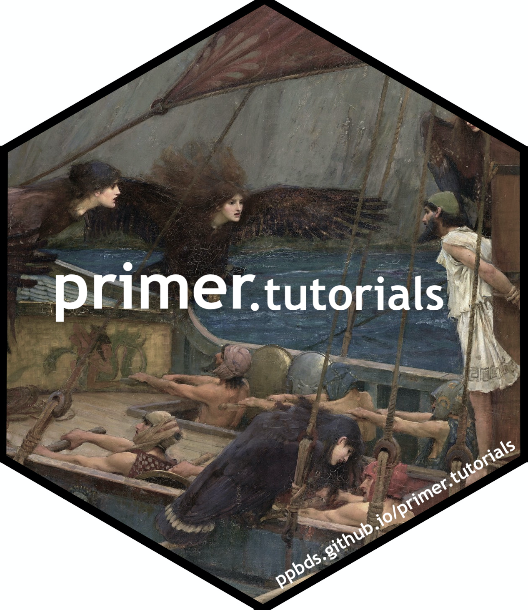
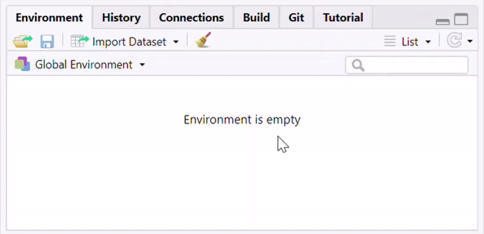

# Tutorials for *Primer for Bayesian Data Science* 

## About this package

`primer.tutorials` provides the tutorials used in the *[Primer for
Bayesian Data Science](https://ppbds.github.io/primer)*.

## Installation

You can install the development version from
[GitHub](https://github.com/) with:

``` r
# install.packages("remotes")
remotes::install_github("PPBDS/primer", subdir = "primer.tutorials")
```

For suggested updates during installation, though you do not have to
have the latest versions of packages, it is recommended you update them.
For packages that need compilation, feel free to answer “no”.

Then **restart your R session** or **restart RStudio**.

## Accessing tutorials

In order to access the tutorials, start by loading the package.

``` r
library(primer.tutorials)
```

 

You can access the tutorials via the Tutorial pane in the top right tab
in RStudio.

If any of the following is happening to you

- Cannot find the Tutorial pane
- Cannot find a tutorial called “Getting Started”

Then **remember to restart your R session** after installing the
package.

Click “Start tutorial”. If you don’t see any tutorials, try clicking the
“Home” button – the little house symbol with the thin red roof in the
upper right.

 



 

In order to expand the window, you can drag and enlarge the tutorial
pane inside RStudio. In order to open a pop-up window, click the “Show
in New Window” icon next to the home icon.

You may notice that the Jobs tab in the lower left will create output as
the tutorial is starting up. This is because RStudio is running the code
to create the tutorial. If you accidentally clicked “Start Tutorial” and
would like to stop the job from running, you can click the back arrow in
the Jobs tab, and then press the red stop sign icon. Your work will be
saved between RStudio sessions, meaning that you can complete a tutorial
in multiple sittings. Once you have completed a tutorial, follow the
instructions on the tutorial `Submit` page and (if you’re a student)
submit the downloaded `rds` file as instructed.

## Working environments and repo setup

**The primary supported environment is VS Code on GitHub Codespaces,
started from the
[`PPBDS/codespace-starter`](https://github.com/PPBDS/codespace-starter)
devcontainer.** The tutorial text is written assuming this setup. R,
Quarto, and all the dependencies are installed in the container, so
there is nothing to install on your own machine. Two local alternatives
— Positron and VS Code running on your own machine — are supported but
require you to install R, Quarto, and the tutorial packages yourself.

**Before you start any exercise tutorial, create a GitHub repo named
after that tutorial.** Use the tutorial’s *name*, not its number —
`nhanes`, `trains`, `colleges`, `biden`, `shaming`, `nes`, `ces`,
`governors`, `stops`. The repo should be **empty**: do *not* check the
“Add a README” box, do *not* add a `.gitignore`, do *not* add a license.
The tutorial walks you through creating those files once you’re inside
the repo.

### Starting a tutorial on Codespaces (primary)

Go to
[`PPBDS/codespace-starter`](https://github.com/PPBDS/codespace-starter),
click **Use this template → Create a new repository**, and name the new
repository after the tutorial you’re about to do (e.g. `nhanes`). Leave
all the optional boxes unchecked — you want an empty copy of the
template, not one with a README/gitignore/license added on top. Once the
repo is created, open it in a Codespace from the **Code → Codespaces**
button on the repo page. The dev container boots with R and Quarto
already configured; proceed to Exercise 2 of the tutorial inside that
Codespace.

### Starting a tutorial locally (Positron or VS Code)

If you prefer to work on your own machine, install R, Quarto, and
`primer.tutorials` (see the Installation section above). Then create an
empty GitHub repo named after the tutorial (no README, no `.gitignore`,
no license), clone it to your machine with your usual workflow
(`File → New Folder from Git` in Positron; `git clone` followed by
opening the folder in VS Code), and open the repo in your editor.
Proceed to Exercise 2.

Regardless of mode, by the time you reach Exercise 2 you should be
sitting inside an empty repo whose name matches the tutorial.

## Re-installation

Since these tutorials are constantly being updated, it is likely that
updates will come out as you use these tutorials.

If you wish to stay up-to-date with the latest version, it is
recommended that you regularly re-install this tutorial package by
running the following 2 lines of code in your **R Console**:

``` r
remove.packages("primer.tutorials")
remotes::install_github("PPBDS/primer", subdir = "primer.tutorials")
```

For version updates for dependency packages please follow the same
considerations as discussed above in the Installation section.

And remember to **RESTART YOUR R SESSION** after you re-installed the
package.
